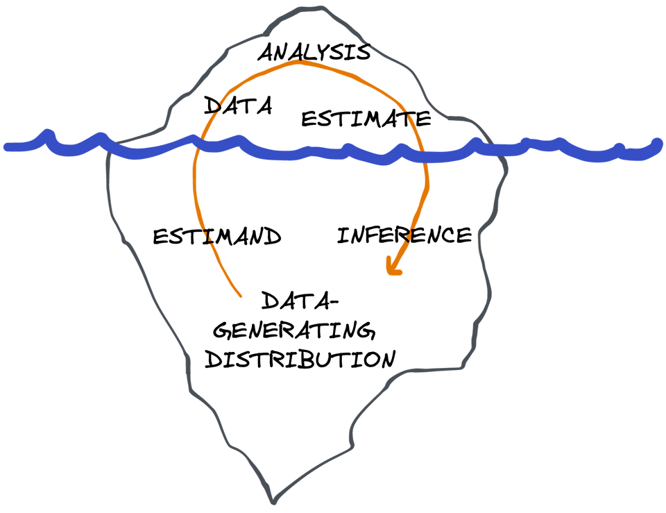

::: content-hidden


```{r}
#| warnings: false
library(tidyverse)
```
:::


# Estimation Problems

The purpose of statistics is to help make decisions based on our observations in the real world. Should we enact rent control? Who should more carefully control their blood pressure? When should we plant crops to maximize yield? All of these are examples of questions where decisions need to be made and can be informed by observations. Statistics comes in when we know that the same or similar experiments, if repeated, would yield different results due to chance variation in the observations (or, from a Bayesian perspective, when those observations incrementally shift the degree to which we beleive something). The vast majority of important real-world questions involve some degree of variability. In this sense, statistics is one of the most important stewards of the scientific process. Surprisingly, however, many traditional courses in statistics do not introduce the "big picture" perspective that I'll lay out here, which is why I feel compelled to include it even though some readers will be familiar with some or all of these concepts.

To answer a question, or make a decision, we usually would like to know a particular number or set of numbers that are "fundamental" to the world but practically or theoretically unobservable. For example, to facilitate vaccine production, we may want to know how many people have the flu. Or, to decide who to market a movie to, we'd like to know what percentage of each market segment would pay to see the film if shown an ad vs. if not. We imagine that these are fixed, but unknown, quantities. We may have access to some sample of people who are either sick or not, or we may have access to a focus group of movie-goers, but what can these observations tell us about the broader populations (or counterfactual populations) we're interested in? How does that depend on what we assume to begin with? That is the question that we attempt to formalize and address in the study of statistics. Before proceeding to the specifics of *causal* inference, we'll first address the fundamentals of estimation problems writ large. 

Not defining a clear question or set of assumptions is by far the largest source of catastrophic errors in any data analysis. No matter what you do with the data, if you didn't have a clear question to begin with, whatever answer you've arrived at is completely meaningless. You'll often see analyses that start with "we took the data and did linear regression; here we report the coefficients and confidence intervals". Without specifying a concrete goal, how can we judge what these coefficients are supposed to mean? Without a clear description of modeling assumptions, how can we know that the confidence intervals actually have their promised level of coverage? You could have infinite data and still get it all wrong. Leaving questions and assumptions implicit causes confusion. 

Of course, it's not always easy to pin down a good question and clarify assumptions. Most of the time, domain experts actually have a large swath of vague, interlocking questions: it's part of the statistician's job to help wrangle these down to something concrete and propose or verify sets of tenable assumptions. That's why you need a good understanding of the formal objects we'll define in this chapter so you can help tie them to the real world.

You can think of this as an iceberg: you get to see the data, what you do with it, and the results. These are all things you can see and "touch" (at least in a computer program). But that's only the tip of the iceberg, the 10% above the waterline. Under the surface, you need to have an imagined space of data-generating distributions (different plausible versions of "the real world"), functions that act on these distributions to reveal their true properties (i.e. definitions of "the answer" in each "world"), and an infinite number of repetitions of the statistical processes that generated the data (to allow for a quantification of uncertainty). That's the 90% of the iceberg that remains submerged; imaginary. Outside of simulations, you can't ever touch these things. It's your job to know they are there. The tip of the iceberg can't exist, or at least doesn't mean anything useful, without the hidden mass below.

::: {#fig-iceberg}



What is visible and what is invisible in a data analysis.
:::

## Data and Distributions

To make progress on this front we have to formalize some ideas. We'll start with what we actually observe in a study: the data. For the purposes of this book, we'll stick to "tabular" data and presume that our data looks something like this:

| $i$ | $W$ | $X$ | $\dots$ | $Y$ |
| --- | --- | --- | --- | --- |
| $1$ | $W_1$ | $X_1$ | $\dots$ | $Y_1$ |
| $2$ | $W_2$ | $X_2$ | $\dots$ | $Y_2$ |
|  ... |  | | | |
| $n$ | $W_n$ | $X_n$ | $\dots$ | $Y_n$ |

The variables $X$, $W$, $Y$, or whatever other symbols we choose to use, represent the different kinds of measurements we take in the study, and the indices $i$ represent the different units of observation. Therefore $X_i$ represents the value of variable $X$ for observation $i$. For example, if we were interested in the effect of a drug, the different observations might corresond to different patients, $W$ their ages, $X$ whether or not they took the drug, and $Y$ some measure of their health afterwards. We presume that all of these values are numbers and I'll usually use caligraphic letters to denote their domains, e.g., $\mathcal X$ is the domain of $X$. These domains are always subsets of the reals $\reals$ - categorical and binary variables are represented with sets of integers and $\{0,1\}$, respectively. Generally I'll let $Z_i$ denote the tuple of all the different measurements for a particular observation $i$ (e.g., $Z_i = (X_i,W_i,Y_i)$) and if I write $Z$ without the subscript I'm referring to a generic or arbitrary observeration.

In statistics we imagine that the data are a draw from an unknown *distribution* $\p^n$ over all $n$ variables $Z_1 \dots Z_n$ that generates the dataset. We'll use blackboard boldface notation $\p$ to denote distributions. A distribution of a random variable $Z$ assigns a probability value in $[0,1]$ to subsets of the $\mathcal Z$, the domain of $Z$. I'll use the curly-brace notation $\p\{\mathcal S\}$ or $\p\{Z \in \mathcal S\}$ to indicate the probability of a set $\mathcal S \subset \mathcal Z$. In a mild and ubiquitous abuse of notation I'll also write $\p\{Z \le z\}$, etc. to denote what should formally and tediously be written as $\p\{ \{ z' \in \mathcal Z: z' \le z \} \}$.

::: {#fig-roadmap-1}
``` tikz
\newcommand{\BlobPad}{4pt}      % extra margin around the blob
\newcommand{\PsiGap}{10pt}      % gap from bottom of blob to Psi
\newcommand{\AxisDrop}{12pt}    % vertical gap from Psi to number line
\newcommand{\AxisLen}{4.2cm}    % length of the number line

\resizebox{12cm}{!}{
\begin{tikzpicture}[
  dot/.style={circle,fill,inner sep=1.6pt}
]

% Movable source point
\node[dot,label=above:$\mathbb P^n$] (P) at (0,0) {};

% Movable dataset "table"
\node[draw, thick, rounded corners=2pt,inner sep=3pt,anchor=west, color=orange, text=orange, label={right:{\color{orange}$\mathbb P_n$}}] (D) at (4,0) {%
  \setlength{\tabcolsep}{4pt}%
  \begin{tabular}{cc}
    $i$ & $Z$ \\ \specialrule{\heavyrulewidth}{0pt}{0pt}  % rule under header
    $1$ & $Z_1$ \\ \midrule
    $2$ & $Z_2$ \\ \midrule
    \vdots & \vdots \\ \midrule
    $n$ & $Z_n$
  \end{tabular}%
};

% Curved arrow with a tiny label above it
\draw[->,thick, dashed]
  (P) to[out=12,in=180]
  (D.west);

\end{tikzpicture}
}
```

A schematic showing that we can imagine our data (labelled $\pn$, to be explained in below) as a draw from an unknown distribution $\p$. The data are shown in orange to illustrate that we can observe them, while the distribution is in black to show that it is not observable. We will add to this schematic as the chapter progresses using the same convention: elements in orange are observable (tip of the iceberg) and elements in black are not (under the surface).
:::

::: callout-warning
If any of the statements $z \in \reals^d$, $\mathcal F = \{f(z): z \in \mathcal Z\}$, $f: \reals \to \mathcal Z$, or $x \mapsto g(x,z)$ aren't absolutely clear to you, you should review some set basics before continuing. The Bright Side of Mathematics has a wonderful series on YouTube titled ["Start Learning Sets"](https://www.youtube.com/playlist?list=PLBh2i93oe2quSTcPiynsSW11Ox6oBBKiq) that should take you less than an hour to get through and covers what you need to know. It is absolutely essential that you understand these notations concretely before proceeding.
:::

All distributions have an associated cumulative distribution function $z \mapsto \p\{Z \le z\}$ that uniquely identifies them. Although not all distributions have standard density functions (with respect to Lebesgue measure), it is sometimes helpful imagine a (multivariate) density function $p(z)$ as the representation of a distribution. This can help facilitate your reasoning. Throughout the book I'll use lowercase $p$ to denote the density of a distribution $\p$.

When necessary, I'll use parentheses to indicate marginal or conditional distributions like $\p(X)$ or $\p(Y|X=x)$ under a joint distribution $\p(Y,X)$. Because when we write $\p\{Y < y| X=x\}$, etc. it is obvious what distribution we're referring to, we only need to write the paranthetical random variables when we are referring to those distributions as objects in and of themselves, not when we are applying them to find the probability of particular sets. 

### The Fiction of Probability

Before going any further, I want to underscore what I said above about *imagining* that data are drawn from a distribution. In the frequentist view, a dataset is a single instantiation of what could have happened under repetitions of a given experiment or physical process. Repeat the experiment, get a different dataset. The probability distribution of the data represents the accumulated patterns of the data over infinite repetitions of the experiment. A probability statement like $\p\{Z > 0\} = 1/2$ means that $Z$ (whatever that is) comes out to be positive in exactly half of the repetitions of the experiment.

Obviously this is a fiction. Very rarely, if ever, can experiments be exactly replicated. If they cannot be replicated, in what sense can we give meaning to the "distribution" of the data? Indeed, a random number generator fundamentally has nothing to do with the physical, biological, or social processes by which numbers end up appearing in a spreadsheet. A probability distribution is a simulacrum of what is actually happening in the real world: a convenient way to smooth over things which we do not really understand while maintaining a transparent, shared vocabulary. Frequentist probability is a shared lie, it is not real in any meaningful way.

Nonetheless, the frequentist probability framework is extremely useful. As humans, we are entirely in the business of fabricating social fictions and operating by them. We have no problem making good use of invented abstractions. *Numbers themselves* are mythical. Certainly you can have two apples or two pencils, but "two" is not real (and neither is an apple - you cannot cleanly define such a thing without social context). Like apples, the number two, and the "laws" of physics, frequentist probability is extremely useful despite not being real. This is roughly the instrumentalist-fictionalist stance in the sense of @fictionalism: mathematical models should be treated as useful "as-if" fictions chosen for empirical adequacy and transparent communication, not as literal features of the world. 

For completeness I should note that subjectivist Bayesian probability gives an account of probability that to me is much more plausible. In that framework, probability reflects a personal degree of belief [@subj-bayes]. I don't want to spend too much time on the details here but roughly speaking my perspective is that Bayesian probability, while philosophically a bit more satisfying, is practically more challenging and socially less valuable than the frequentist framework because priors are difficult to agree on and because Bayesian nonparametrics are very unweildy. Many people would vehemently disagree with me on that, but empirically it appears to be true: frequentist probability is far more popular in the wild. And, ultimately, subjective Bayesian probability is also a myth in the same sense as any other mathematics: it just buries its lies a bit deeper than the frequentist framework. The fact that there are entire textbooks devoted to the philosophy of probability (e.g., @philosophy) should be enough to convince you that no approach is entirely salvageable or coherent.

### Independent Observations

For the purposes of this book we will only consider distributions where the different observtions $i \in \{1 \dots n\}$ are considered *independent* and *identically distributed* (IID). That is, where joint probabilities factor as $\p(Z_i, Z_j) = \p(Z_i) \p(Z_j)$ for $i\ne j$. That is why I used the suggestive notation $\p^n$ to indicate the distribution of the the entire dataset above: $\p$ indicates the distribution of a single, generic observation and $\p^n$ indicates the distribution of the entire dataset which, by independence, is simply the product of the $n$ identical per-observation distributions. 

::: {#fig-roadmap-2}
``` tikz
\newcommand{\BlobPad}{4pt}      % extra margin around the blob
\newcommand{\PsiGap}{10pt}      % gap from bottom of blob to Psi
\newcommand{\AxisDrop}{12pt}    % vertical gap from Psi to number line
\newcommand{\AxisLen}{4.2cm}    % length of the number line

\resizebox{12cm}{!}{
\begin{tikzpicture}[
  dot/.style={circle,fill,inner sep=1.6pt}
]

% Movable source point
\node[dot,label=above:$\mathbb P$] (P) at (0,0) {};

% Movable dataset "table"
\node[draw, thick, rounded corners=2pt,inner sep=3pt,anchor=west, color=orange, text=orange, label={right:{\color{orange}$\mathbb P_n$}}] (D) at (4,0) {%
  \setlength{\tabcolsep}{4pt}%
  \begin{tabular}{cc}
    $i$ & $Z$ \\ \specialrule{\heavyrulewidth}{0pt}{0pt}  % rule under header
    $1$ & $Z_1$ \\ \midrule
    $2$ & $Z_2$ \\ \midrule
    \vdots & \vdots \\ \midrule
    $n$ & $Z_n$
  \end{tabular}%
};

% Curved arrow with a tiny label above it
\draw[->,thick, dashed]
  (P) to[out=12,in=180]
  node[pos=0.55, above, sloped, allow upside down, fill=white, inner sep=1pt] {$\scriptstyle n$}
  (D.west);

\end{tikzpicture}
}
```

For IID observations, the data are generated by sampling from the distribution $\p$ repeatedly for a total of $n$ times.
:::


Independence and interchangeability of observations is a strong assumption: to assess it, you can imagine repeating your "experiment" or data-generating process many, many times to gather different datasets of the same size as the one you observe. If you take the first row $Z_1$ from each of these datasets and subset to those datasets where $Z_2 = z_2$ (or another condition), the distribution of $Z_1$ in that subset should be the same as it is across the entire collection of datasets. 

::: {.Exm #exm-non-iid-data}
Let's say $Z_i$ are binary indicators of whether a person $i$ has the flu or not. Imagine first an experiment where on January 1st of 2025 we sample 100 random people in Berkeley, California and test them for flu. Repeating this experiment would require time travel, but in this setup the observations $Z_1$ and $Z_2$ would be essentially independent (modulo the fact that Berkeley has a finite population; we can sensibly ignore this since it is large relative to the sample size). The only randomness comes from who we sample, and sampling one person does not make it more or less likely that the rest of the sample is sick or healthy. 

In contrast, consider a version of the "experiment" where we first pick a random day in 2025, and then pick 100 random people in Berkeley. In this setup, knowing that one person is sick in our dataset actually gives us a lot of information about the others. The reason is simple. If we look at person 1 and see they have the flu, that makes it more likely that our sample was taken during flu season and therefore it's more likely that other have the flu too. Or, explained more literally, if we subset to all the datasets where person 1 has the flu, more of those will have been taken in flu season and therefore the distribution of $Z_2$ in those datasets will be tilted towards 1 more than the general distribution of $Z_2$. 

:::: {.callout-important appearance="minimal"}
::: {#exr-iid-data}
Imagine an experiment where we first pick a random city and then sample 100 people and test if they have flu. Are two people's test results independent in that setup? Why or why not?

Does your answer change if the disease tested in the study is genetic (like sickle-cell anemia) instead of contagious (like the flu)?
:::
::::

Statistics has nothing to say about which version of the experiment is the correct one. A dataset of 100 flu tests from Berkeley is equally compatible with all three hypothetical experiments. There is not a mathematically wrong answer in terms of determining whether the observations are independent, even though that assuption impacts the analysis and interpretation of the data. 

While we may never actually repeat *any* version of our experiment, it's certainly more plausible to imagine a similar experiment in a different city or in a different time as "repetition" of our experiment than it is to go back in time. The result of our analysis has more social utility if we interpret the data as coming from the random-time or random-city experiments, and therefore this is the more sensible choice. Therefore, in this context, we should often treat $Z_1$ and $Z_2$ as *dependent* rather than *independent*. 
:::

In @exm-non-iid-data, the dependence arises because the flu is a contagious disease that clusters temporally and geographically. In many other cases, independence is a more reasonable assumption. For the remainder of this book we will assume IID data, partly because this covers a large number of practical applications and partly because it simplifies things in a way that is useful for learning. Similar ideas apply in non-IID settings, but it is easier to understand that theory after covering the IID case.

When the data are assumed IID, taking a dataset of size $n$ from a distribution is equivalent to sampling $n$ times with replacement from some (possibly infinite) "population" of possible rows of data. I often find it helpful to reason in terms of a very large, yet finite population, i.e., a data table very similar to the one shown above, but with a huge number of rows $n^*$. In that case, the joint probability distribution $\p$ is nothing more than the joint histogram of that population dataset. In fact, you can even think of the $\p$ as standing for "$\p\text{opulation}$". 

In a large, finite population, evaluating a probability like $\p\{X>5\}$ reduces to counting the number of rows that satisfy the condition $X > 5$ in that dataset and dividing by $n^*$. Similarly, $\p\{X>5|Y=2\} = \frac{\#\{X>5, Y=2\}}{\#\{Y=2\}}$, the number of rows where $X > 5$ among those with $Y=2$. All of the standard rules and theorems of probability (Bayes' Theorem, total expectation, etc.) are easy to derive intuitvely in this setting.

## Models

We presume that data are drawn from some distribution, but we do not pretend to know what that distribution actually is. However, we may know something at least about some *aspects* of the distribution. 

::: {.Exm #exm-positive-rv-assumptions}
Let's say $Z_i$ represents someone's age in a random sample from a population of interest and that is all we are told. We model $Z_i  \overset{\text{IID}}\sim \p$ with $\p$ unknown. However, since $Z$ represents age, we actually already know that $\p\{Z \ge  0\} = 1$. Note that other aspects of the distribution may still be unknown: we certainly don't know if there are more children than adults, what the mean age is, etc. If we are somewhat more ambitious, however, we may also be comfortable assuming $\p\{Z \le  200\} = 1$ or some other large age depending on the population of interest, since, to my knowledge, nobody has ever lived that long!
:::

::: {.Exm #exm-rct-assumptions}
##### Randomized Trial
Presume that we collect data from a simple randomized trial. In a randomized trial, participants $i$ are recruited from a population of interest. Usually some measurements (age, sex, disease state) are taken at baseline. We'll call these the *covariates* and denote them with $X_i$ for each participant. Once they are enrolled, participants are randomized by a fair 50/50 coin flip to receive either an experimental treatment (e.g., a drug) or placebo (alterantively, some standard-of-care treatment). We use $A_i \in \{0,1\}$ to denote whether or not the participant was in the treatment arm ($A=1$) or control $(A=0)$. After some time elapses for each participant, an outcome $Y_i$ (e.g., disease state) is measured for each person.

For IID observations, we have $(Y,A,X)_i \overset{\text{IID}}\sim \p$ for some distribution $\p$. While $\p$ is unknown, we actually do know something about it. Namely, $\p(A=1|X) = 1/2$. This is not an assumption: since the trial was randomized, we know this for a fact!

Since the randomization happens individually for each person, we know the conditioning on $X$ is appropriate: the population distribution of the treatment will be 50/50 in any stratum of the covariates $X=x$. That's why we know $\p\{A=1|X\} = 1/2$ and not just the weaker statement $\p\{A=1\} = 1/2$. The latter would just imply that half of the people in the population get treated, but that could easily happen if, e.g., we treat all women and don't treat all men.
:::

As the examples show, there is often some knowledge about the distribution: at a minimum, we usually know the domains of the different variables. A *statistical model* is a tool to formalize these pieces of knowledge.

:::: callout-note
##### Model
::: {#def-model}
A *statistical model* (or just *model*) is any set $\model$ whose elements are probability distributions. 
:::
::::

The definition of a model is extremely simple. The utility comes when we define models that align with our knowledge or suppositions so that the model formalizes what we believe about the world. If the model reflects reality in this way, then the true data-generating distribution $\p$ is an element of the model, i.e., $\p \in \model$. The problem of statistics, in its most ambitious form, is to try and deduce which element of $\model$ is the data-generating distribution based on an observed dataset sampled from that distributon.

Since we'll assume IID data throughout this book, we won't write that as a restriction on the model. That is, instead of specifying the set of data distributions $\p^n$, we'll just specify the set of distributions $\p$ possible for a generic, individual observation. The latter model on individual observations induces the former model on datasets, i.e., $\model^n = \{\p^n : \p \in \model \}$.


::: {#fig-roadmap-3}
``` tikz
\newcommand{\BlobPad}{4pt}      % extra margin around the blob
\newcommand{\PsiGap}{10pt}      % gap from bottom of blob to Psi
\newcommand{\AxisDrop}{12pt}    % vertical gap from Psi to number line
\newcommand{\AxisLen}{4.2cm}    % length of the number line

\resizebox{12cm}{!}{
\begin{tikzpicture}[
  dot/.style={circle,fill,inner sep=1.6pt}
]

% Movable source point
\node[dot,label=above:$\mathbb P$] (P) at (0,0) {};

% Movable dataset "table"
\node[draw, thick, rounded corners=2pt,inner sep=3pt,anchor=west, color=orange, text=orange, label={right:{\color{orange}$\mathbb P_n$}}] (D) at (4,0) {%
  \setlength{\tabcolsep}{4pt}%
  \begin{tabular}{cc}
    $i$ & $Z$ \\ \specialrule{\heavyrulewidth}{0pt}{0pt}  % rule under header
    $1$ & $Z_1$ \\ \midrule
    $2$ & $Z_2$ \\ \midrule
    \vdots & \vdots \\ \midrule
    $n$ & $Z_n$
  \end{tabular}%
};


% Curved arrow with a tiny label above it
\draw[->,thick, dashed]
  (P) to[out=12,in=180]
  node[pos=0.55, above, sloped, allow upside down, fill=white, inner sep=1pt] {$\scriptstyle n$}
  (D.west);

% --- irregular blob around P, sized from D (draw first so arrow/point sit on top) ---
\draw[thick, teal]
  let
    \p1 = ($(D.east)-(D.west)$),   % dataset width vector
    \p2 = ($(D.north)-(D.south)$), % dataset height vector
    \n1 = {0.8*abs(\x1) + \BlobPad}, % baseline x-radius
    \n2 = {0.5*abs(\y2) + \BlobPad}  % baseline y-radius
  in
  plot[smooth cycle, tension=0.85] coordinates {
    ($(P)+({\n1*0.92*cos( 30)},{\n2*0.92*sin( 30)})$)
    ($(P)+({\n1*0.95*cos( 90)},{\n2*0.95*sin( 90)})$)
    ($(P)+({\n1*0.9*cos(120)},{\n2*0.9*sin(120)})$)
    ($(P)+({\n1*1.05*cos(180)},{\n2*1.05*sin(180)})$)
    ($(P)+({\n1*0.97*cos(210)},{\n2*0.97*sin(210)})$)
    ($(P)+({\n1*1.12*cos(240)},{\n2*1.12*sin(240)})$)
    ($(P)+({\n1*1.08*cos(300)},{\n2*1.08*sin(300)})$)
    ($(P)+({\n1*0.96*cos(330)},{\n2*0.96*sin(330)})$)
  };

% label for the blob (placed near its top)
\path
  let \p1 = ($(D.east)-(D.west)$), \p2 = ($(D.north)-(D.south)$),
      \n2 = {0.5*abs(\y2) + \BlobPad}
  in node[above, font=\Large, teal] at ($(P)+(0,\n2)$) {$\mathcal P$};

\end{tikzpicture}
}
```

The model is shown here as a blob around the distribution $\p$. The model is known in the sense that it is determined by the assumptions the analyst is willing to make. However, it is a theoretical construct and not directly tangible to the analyst (in terms of code, etc.) so we show it in teal.
:::

::: {.Exm #exm-rct-model}
##### Randomized Trial
In @exm-rct-assumptions above we discussed randomized trials and concluded that $\p(A|X)$ is known in such situations. Therefore an appropriate model to use in a randomized trial setting is

$$
\model = \{\p: \p\{A=1|X\}=1/2\}
$$

:::

::: {.Exm #exm-lin-reg-model}
##### Linear Regression with Normal Errors
In settings where a vector of predictors $X \in \reals^d$ and an outcome $Y \in \reals$ are observed for each observation, it is sometimes mathematically convenient to assume that the conditional expectation ("regression function") of the outcome is a linear function of $X$ and that the outcome is determined by adding gaussian noise to this function. Therefore, the *linear regression* model (with normal errors) for the conditional distribution $\p(Y|X)$ is

$$
\model = \left\{ \norm(X^\top\beta, \sigma^2) : \beta \in \reals^d, \sigma^2 > 0 \right\}
$$

:::

Unfortunately, using the term "model" for a set of distributions (one of which is the "real" one) somewhat conflicts with the way "model" is often used coloquially. In the langauge of statistical theory, *the* linear regression model is the set described in @exm-lin-reg-model. But often people will refer to *a* linear regression model $Y = X^\top \hat\beta + \norm(0,1)$ for some fixed value of $\hat\beta$, referring to the result of "fitting" the model. The former use refers to a set of distributions while the latter refers to a specific distribution in this set. In the language we will develop shortly, something like $Y = X^\top \hat\beta + \norm(0,1)$ would be called an *estimate* of the conditional distribution, rather than a model for it.

Since models are sets, they can certainly be compared in terms of sub- and super-sets. The randomized trial model in @exm-rct-model is a subset of a "larger" model where nothing is assumed about $\p(A|X)$, and a superset of a model where the covariate distribution $\p(X)$ is also known. We often use langauge like this informally, saying that certain models are relatively large and others are relatively small. Another way to measure the size of the model is to count how many parameters it takes to parametrize it.

:::: callout-note
##### (Non)Parametric Model
::: {#def-param-model}
A *parametric model* of dimension $d$ is any model $\model$ whose elements can be put into correspondence with some subset of real vectors $\Theta \subseteq \reals^d$ without running out of vectors. An element $\theta \in \Theta$ is called a *parameter value* and each coordinate of $\theta = [\theta_1 \dots \theta_d]$ is usually referred to as a (scalar) parameter.

Formally, a model $\model$ is ($d$-dimensionally) parametric if there exists an onto function from $\Theta$ to $\model$. Usually this function is written $\theta \mapsto \p_\theta$ so that $\p_\theta$ denotes the distribution associated with or "indexed by" the parameter value $\theta$. 

Any model that cannot be indexed with a finite-dimensional vector space is called *nonparametric*.
:::
::::

::: {#fig-parametric-model}

``` tikz
\definecolor{pcol}{RGB}{184,36,79}   % for P1 / theta1
\definecolor{qcol}{RGB}{0,132,150}   % for P2 / theta2
\tikzset{every node/.style={font=\Large}}

\resizebox{12cm}{!}{
\begin{tikzpicture}[scale=0.9,>=Latex]

% ================== AXES (left; independent) ==================
\begin{scope}[shift={(-6,0)}]
  % axes
  \draw[line width=2pt,-{Latex[length=3.5mm]}] (-2.2,0) -- (3.8,0); % x
  \draw[line width=2pt,-{Latex[length=3.5mm]}] (0,-2.8) -- (0,3.0); % y

  % ticks
  \foreach \x in {-2,-1,0,1,2,3}
    \draw[line width=1pt] (\x,-0.12) -- (\x,0.12);
  \foreach \y in {-2,-1,0,1,2}
    \draw[line width=1pt] (-0.12,\y) -- (0.12,\y);

  % label for the parameter space
  \node[font=\huge] at (2,2) {$\Theta$};

  % theta points (named for later arrows)
  \coordinate (th1) at (1.3,1.0);
  \fill[pcol] (th1) circle (3pt);
  \node[pcol,anchor=east] at (th1) {${\theta}_{1}$};

  \coordinate (th2) at (3.0,-0.5);
  \fill[qcol] (th2) circle (3pt);
  \node[qcol,anchor=east] at (th2) {${\theta}_{2}$};
\end{scope}

% ================== BLOB / MODEL SET (right; independent) ==================
\begin{scope}[shift={(3,0)}]
  % model set as a blob
  \draw[line width=2pt]
    plot [smooth cycle, tension=0.9]
    coordinates{(-3,-2) (-2,1.3) (-1,2.6) (0.7,2.2) (1.6,0.1) (0.6,-1.9) (-1.4,-2.6)};

  % label for the model space
  \node[font=\huge] at (-0.2,2.0) {$\mathcal P$};

  % points P1, P2 (named for arrows)
  \coordinate (P1) at (-1.2,0.8);
  \fill[pcol] (P1) circle (2.6pt);
  \node[pcol,anchor=west] at (P1) {$\mathbb P_{\theta_1}$};

  \coordinate (P2) at (-1.4,-1.7);
  \fill[qcol] (P2) circle (2.6pt);
  \node[qcol,anchor=west] at (P2) {$\mathbb P_{\theta_2}$};
\end{scope}

% ================== ARCED ARROWS: theta_j -> P_j ==================
% First arrow (slight upward arc)
\draw[pcol,line width=2pt,shorten >=2pt,shorten <=2pt,-{Latex[length=3mm]}]
  (th1) to[out=10,in=170,looseness=1.05] (P1);

% Second arrow (slight downward arc)
\draw[qcol,line width=2pt,shorten >=2pt,shorten <=2pt,-{Latex[length=3mm]}]
  (th2) to[out=-10,in=180,looseness=1.05] (P2);

\end{tikzpicture}
}
```

In a parametric model, each distribution corresponds to some parameter value in a finite-dimensional space.

:::

The classical linear regression model in @exm-lin-reg-model is an example of a parametric model that has $d + 1$ parameters ($d$ for the components of the coefficient vector $\beta$ plus one for $\sigma^2$). Forcing one of the coefficients to be zero (equivalent to omitting a predictor) would result in a model with one fewer dimension. 

Parametric models can always be parametrized in different ways. For example, the set of all normal distributions can be parametrized with the mean $\mu$ and the standard deviation $\sigma$ (as usual), or it can be parametrized with the natural parameters of the exponential family (it doesn't matter if you don't know what that is) which are $\theta_1 = \mu/\sigma^2$ and $\theta_2 = -1/(2\sigma^2)$. The mappings $(\mu, \sigma) \mapsto \p_{\mu, \sigma}$ and $(\theta_1, \theta_2) \mapsto \p_{\theta_1, \theta_2}$ are essentially two different naming or labelling conventions for the same set of distributions, in this case normals. 

Nonparametric models can also (confusingly) be parametrized - just not with a finite-dimensional parameter. For example, the set of all distributions that have continuous densities can be parametrized by those densities themselves: we could write a mapping $p \to \p_p$ from densities to the corresponding distributions. But, of course, the set of density functions $p$ is not a finite-dimensional space. "Finite-dimensional" is therefore a clearer descriptor than "parametric", but we're stuck with the terms we have. 

::: callout-warning
To learn more about spaces of functions you can peek at @sec-app-L2-vectors. You won't need any of that material at this point in the book but it's there if you're curious.
:::

Sometimes a nonparametric model is parametrized partly with finite-dimensional parameter and partly with an infinite dimensional parameter. Such models are usually called *semiparametric*, but formally they are one kind of nonparametric model, or specifically one way of parametrizing a nonparametric model.

::: {.Exm #exm-symmetric-location-model}
Presume that we measure a continuous variable $Z$ which, for some reason, we know should have a symmetric distribution around its mean. This might be a reasonable assumption when taking noisy measurements of a physical system. One way to formalize this is to assume the model

$$
\begin{aligned}
Z &= \mu + W \\
p(w) &= p(-w).
\end{aligned}
$$

The second line enforces the fact that the noise $W$ has zero mean and a symmetric distribution around zero. 

This is a semi-parametric model parametrized by $(\mu, p(w))$. The first parameter is a scalar, but the second is a function. Overall the model is nonparametric, but in this parametrization we've isolated some feature of the distributions in the model as a finite-dimensional parameter.
:::

Nonparametric (i.e., infinite-dimensional) models can also be relatively larger or smaller than each other. For example, the set of all continuous probability densities of a variable $Z$ is larger than the set of all such densities that are zero for all negative $z$, but both are nonparametric. 

In a given statistical problem, there is rarely a single "correct" model to use. However, the general principle is that one should work with the smallest-possible tractable model that reasonably contains the true data-generating distribution. Since that distribution is never known, this principle essentially means that you should only make assumptions that you are near-certain of. A lot of the time that means working with nonparametric models like the set of all probability distributions, and there is nothing wrong with that! In this book we won't shy away from the complexity of the real world and we will see that the methods we come up with are often not any more complicated from a user's perspective.

Statisticians often like to hide behind the famous George Box maxim "*all models are wrong, but some are useful*" when they use low-dimensional parametric models like linear regression without justification. In absolute terms, I agree with the quote: it's very much in line with the instrumentalist-fictionalist perspective on frequentist probability as a whole. Where I disagree is in the way the quote is abused. An incorrect model is certainly not useful when it produces answers that are entirely wrong! In a relative sense, there are important degrees of incorrectness that should not be washed away without argument by appealing to a pithy quote.

In some cases it is justifiable to use models that are patently wrong, but only if the rationale is clearly explained (we'll see an example later in the book). Usually this occurs when the incorrectness of the model don't actually matter to the specific problem at hand. When we do this we are careful to call the model a *working* model to indicate that we do not actually beleive the model restrictions reflect plausible assumptions about the real world. 

## Estimands

We've filled the role of a data-generating process (or "reality") with an unknown probability distribution $\p$. For example, we might imagine that each person's income in some country is a random variable. We've also represented our existing knowledge about the unknown distribution using the model $\model$. Now we need to fill the role of our scientific quantity of interest; i.e., we must explain how to translate a question like "what is a usual income?" into the language of probability. That is the purpose of an estimand.

:::: callout-note
##### Estimand
::: {#def-param-model}
An *estimand* $\Psi$ is a function whose domain is a statistical model $\p$ and whose value at the unknown data-generating distribution is of scientific interest. 
:::
::::

Framing the estimand as a *function* makes a lot of sense: the "true" value that we are trying to estimate depends on what the underlying data-generating distribution is! 

::: {#fig-roadmap-4}
``` tikz
\newcommand{\BlobPad}{4pt}      % extra margin around the blob
\newcommand{\PsiGap}{10pt}      % gap from bottom of blob to Psi
\newcommand{\AxisDrop}{12pt}    % vertical gap from Psi to number line
\newcommand{\AxisLen}{4.2cm}    % length of the number line

\resizebox{12cm}{!}{
\begin{tikzpicture}[
  dot/.style={circle,fill,inner sep=1.6pt}
]

% Movable source point
\node[dot,label=above:$\mathbb P$] (P) at (0,0) {};

% Movable dataset "table"
\node[draw, thick, rounded corners=2pt,inner sep=3pt,anchor=west, color=orange, text=orange, label={right:{\color{orange}$\mathbb P_n$}}] (D) at (4,0) {%
  \setlength{\tabcolsep}{4pt}%
  \begin{tabular}{cc}
    $i$ & $Z$ \\ \specialrule{\heavyrulewidth}{0pt}{0pt}  % rule under header
    $1$ & $Z_1$ \\ \midrule
    $2$ & $Z_2$ \\ \midrule
    \vdots & \vdots \\ \midrule
    $n$ & $Z_n$
  \end{tabular}%
};


% Curved arrow with a tiny label above it
\draw[->,thick, dashed]
  (P) to[out=12,in=180]
  node[pos=0.55, above, sloped, allow upside down, fill=white, inner sep=1pt] {$\scriptstyle n$}
  (D.west);

% --- irregular blob around P, sized from D (draw first so arrow/point sit on top) ---
\draw[thick, teal]
  let
    \p1 = ($(D.east)-(D.west)$),   % dataset width vector
    \p2 = ($(D.north)-(D.south)$), % dataset height vector
    \n1 = {0.8*abs(\x1) + \BlobPad}, % baseline x-radius
    \n2 = {0.5*abs(\y2) + \BlobPad}  % baseline y-radius
  in
  plot[smooth cycle, tension=0.85] coordinates {
    ($(P)+({\n1*0.92*cos( 30)},{\n2*0.92*sin( 30)})$)
    ($(P)+({\n1*0.95*cos( 90)},{\n2*0.95*sin( 90)})$)
    ($(P)+({\n1*0.9*cos(120)},{\n2*0.9*sin(120)})$)
    ($(P)+({\n1*1.05*cos(180)},{\n2*1.05*sin(180)})$)
    ($(P)+({\n1*0.97*cos(210)},{\n2*0.97*sin(210)})$)
    ($(P)+({\n1*1.12*cos(240)},{\n2*1.12*sin(240)})$)
    ($(P)+({\n1*1.08*cos(300)},{\n2*1.08*sin(300)})$)
    ($(P)+({\n1*0.96*cos(330)},{\n2*0.96*sin(330)})$)
  };

% label for the blob (placed near its top)
\path
  let \p1 = ($(D.east)-(D.west)$), \p2 = ($(D.north)-(D.south)$),
      \n2 = {0.5*abs(\y2) + \BlobPad}
  in node[above, font=\Large, teal] at ($(P)+(0,\n2)$) {$\mathcal P$};

% --- trapezoid (pointing down) with Psi ---
\path
  let \p2 = ($(D.north)-(D.south)$),
      \n2 = {0.5*abs(\y2) + \BlobPad + 30}
  in coordinate (BelowBlob) at ($(P)+(0,-\n2)$);
  
\node[
  draw, thick, trapezium, trapezium stretches=true,
  trapezium angle=70, shape border rotate=180,
  minimum width=1.8cm, minimum height=0.9cm,
  inner sep=2pt, color=teal, fill=teal!10!white
] (Psi) at ($(BelowBlob)+(0,-\PsiGap)$) {$\Psi$};

% arrow from P down into Psi
\draw[->,thick] (P) -- (Psi.north);

% --- number line (two-headed) down-right from Psi ---
\coordinate (AxisLeft)  at ($(Psi.south)+(0.1cm,-\AxisDrop-20)$);
\coordinate (AxisRight) at ($(AxisLeft)+(\AxisLen,0)$);
\draw[<->,thick] (AxisLeft) -- (AxisRight);  % left-right number line

% arrow from Psi to a point on the number line
\coordinate (AxisPoint) at ($(AxisLeft)!0.35!(AxisRight)$);
\draw[->,thick] (Psi.south) -- (AxisPoint);

% 4) Label the endpoint of the arrow from Psi as \psi (without changing your arrow)
\node[below] at (AxisPoint) {$\psi$};

\end{tikzpicture}
}
```

The estimand is shown here as a box that maps a distribution $\p$ in the model $\model$ into a number on the number line. Different points in the model could map to different points on the number line. The estimand is known to the analyst, but is also a theoretical construct that is not instantiated in code; it represents the scientific question of interest that could be answered if we had access to the true distribution $\p$. Although the mapping is known, the distribution is not, so the input (and thus output) of the estimator are unknown and colored black to reflect that.
:::


In traditional (parametric) statistics, the same problem is addressed by making one or more parameters $\theta$ the object(s) of interest. Certainly in a parametric model we can define an estimand $\Psi(\p_\theta) = \theta$, but when the data-generating distribution is no longer in the parametric model, this definition has no meaning. Thinking of estimands first and foremost as mappings that extract generic properties of a distribution solves the problem. In this way we can formalize the scientific question of interest before we even pin down a model, parametric or otherwise.

What I call an estimand is often called a parameter throughout the statistics literature, or more specifically a *target parameter*. That term makes sense since finite-dimensional parameters are one extractable aspect of a distribution in a parametric model and the definition of an estimand generalizes this idea. I prefer the term estimand, however, because it clearly communicates that it is what we are going to *estimate*. To me, it sounds less abstract and more approachable than "target parameter". It also makes a clean break with the "parameters" of parametric models and therefore avoids confusion. Lastly, the term "estimand" is gaining popularity in regulatory agencies and in clinical trials, perhaps also because it clearly evokes what it means [@estimands].

::: {.Exm #exm-estimand-mean}
##### Mean
Presume we have a continuous random variable $Z$ (i.e., with a density function) with an unknown distribution $\p$. The mean of $Z$ is a common estimand defined by

$$
\Psi(\p) = \E_\p[Z] = \int z\ p(z) \dd z
$$

Different distributions have different means. If the mean estimand were evaluated at $\p = \norm(0,1)$, the result would be 0. If it were evaluated at $\p = \unif(1,2)$, the result would be $1/2$. 

Our definition of the mean estimand is more general than an alternative definition that could work in a parametric model. For example, if the model were $\model = \{\norm(\mu,1):\mu \in \reals\}$, the estimand would traditionally be the parameter $\mu$. But if the model were $\model = \{\unif(a,b): a < b \in \reals \}$, the estimand would be $(b-a) / 2$. By writing $\Psi(\p) = \E_\p[Z]$ we easily generalize both of these model-specific definitions.
:::

::: {.Exm #exm-estimand-reg-coef}
##### Regression Coefficient
Let's say we collect a scalar predictor $X$ and outcome $Y$ for each observation and we're interested in what increase in the average outcome is associated on average with a one-unit increase in the predictor. 

A traditional approach to this problem would be to suppose a linear regression model (e.g. @exm-lin-reg-model). Under this model, $Y = \norm(\beta_0 + X\beta, \sigma^2)$ and a one-unit increase in $X$ translates to an average increase in $Y$ of $\beta$ units. Therefore the estimand would be the parameter $\beta$.

This approach completely falls apart if we are not willing to assume linearity. And why should we? The vast majority of physical, biological, or social processes are nonlinear in important regimes. To formulate this estimand as a function of a generic distribution, we can instead take

$$
\begin{aligned}
\Psi(\p) &= \E_\p\big[\E_\p[Y|X+1] - \E_\p[Y|X]\big] \\
&= \E_\p[\mu_\p(X+1) - \mu_\p(X)]
.
\end{aligned}
$$

This is a literal interpretation of the question: "what increase in the average outcome is associated on average with a one-unit increase in the predictor". We first extract the conditional mean function $\mu_\p(x) = \E_\p[Y|X=x]$, which encodes the average outcome at any level of the predictor. We then compare that average outcome at each value $x$ to the corresponding average outcome that we expect to observe if the predictor were augmented by one unit to $x+1$. Lastly, we average those differences over the values of $X$ taken in the population. 

When the distribution of interest is in the linear model, this definition coincides exactly with the value of the parameter $\beta$. But our construction makes it so much clearer what $\beta$ actually represents scientifically.
:::

Estimands can also be defined implicitly as values that satisfy or minimize/maximize a particular equation.

::: {.Exm #exm-estimand-median} 
##### Median 
Let $Z$ be a scalar-valued random variable. The median of $Z$ under a distribution $\p$ is 

$$
\Psi(\p) = \arg\inf_z  \big\{z: \p\{Z \le z\} \ge 1/2 \big\},
$$

in other words, the smallest number such that half the probability mass is to the left of it. An equivalent formulation is to say the median of $Z$ under $\p$ is the (smallest) minimizer of $\E_\p|Z - z|$ in $z$ 

:::

Estimands can be scalar ($\Psi: \model \to \reals$, like the examples above) or vector valued ($\Psi: \model \to \reals^d$) or even function-valued ($\Psi:\model \to \eltwo$, for example). Fitting a regression function is an example of estimating a function-valued estimand. In this book we'll deal only with scalar estimands because this reduces notational complexity and because most of the common estimands in causal inference are scalar. However, the methods we develop extend easily to vector estimands and even to some functional estimands in certain cases.

### Notation for Expectation {#sec-emp-proc-notation}
In @exm-estimand-reg-coef, we defined the estimand $\E_\p[\mu_\p(X+1) - \mu_\p(X)]$. Many of the estimands we'll be working with will look similar to this: expectations of some function, i.e. $\Psi(\p) = \E_\p[f(Z)]$. It quickly becomes cumbersome to write $\E_\p[f(Z)]$ over and over again, so in this book we'll often denote expectations of functions of random variables using the notation

$$
\p f = \E_\p [f(Z)]
.
$$

This is called *empirical process notation* for expectation becasue it originates in the literature on empirical process theory. We'll learn a little about empirical processes later in the book but they're not a big part of what we'll discuss. Nonetheless, the notation by itself is quite neat so we will certainly borrow it.

The motivation this notation is fairly straightforward. Any expectation is always with respect to some distribution $\p$. Generally we leave The $\p$ subscript off, but in many situations it's nice to have it there when we're talking about a quantity that varies depending on $\p$. But when we do that, there's really no point in all the notational clutter of $\E_\p$ when we can simply write $\p$ and be done with it. Naturally this is an abuse of notation since $\p\{Z \in \mathcal Z\}$ measures the probability of a set, but we can easily disambiguate expectation from a probability statement because what comes to the right of the $\p$ will either be a set (for probability) or a function (for expectation). When needed, I'll use square brackets to distinguish a probability statment $\p\{\cdot\}$ from an expectation $\p[\cdot]$ or to clarify exactly what is in the expectation. But, keeping in convention with the notation for linear operators (like matrix multiplication), we usually leave the brackets off, writing $\p f$ instead of $\p[f]$

The expectation and probability operators are very closely related anyways. For any set $\mathcal S$, we have the identity $\p\{\mathcal S\} = \E[1_{\mathcal S}(Z)]$, or, in empirical process notation, $\p\{\mathcal S\} = \p 1_{\mathcal S}$. If you're not familiar with this identity, it's easy to see for random variables with densities: $\p\{Z \in \mathcal S\} = \int 1_{\mathcal S}(z) \ p(z) \dd z = \int_{\mathcal S} \ p(z) \dd z$.

Another thing to be aware of with this notation is that the $\p$ is understood to be a function that maps *functions* (of random variables) to numbers, not random variables to numbers. When you use the $\E[\cdot]$ notation, you always need to have some random variable (e.g., $Z$) in the argument. For example, $\E[f(Z)]$ is grammatically correct, but $\E[f]$ is not. On the other hand, $\p f$ is correct, but $\p f(Z)$ is not. In the empirical process notation, all the random variables are considered to be already baked into the operator $\p$ that specifies their distributions, so there is no need to write them. 

Nonetheless you will see some abuses of this in the wild, like people writing $\p Z$ or $\E[f]$ - it's ok from time to time as long as you have good reason to do it and it's clear what is meant. One particularly aggravating shortcoming is that it's awkward to write the simple expectation $\E_\p[Z]$ using empirical process notation. The correct way to do it would be $\p[z \mapsto z]$ but this is hardly more concise. I'll compromise and write $\p z$ as a shorthand for "$\p f$ where $f(z) = z$".

Lastly, the empirical process expectation never averages over any possible randomness in its function-valued argument. For example, let $\hat f$ be the result of fitting a linear regression, i.e. $\hat f (x) = x^\top \hat\beta$. The coefficients $\hat\beta$ depend on the random data $(Y,X)_{1,\dots n}$ and so they are random variables too. Therefore $\hat f$ is a *random function*. 

When we write $\p \hat f$, we are indicating that we only want to average over the randomness in the *input* to $\hat f$, not the randomness in $\hat f$ itself. Another more verbose way to indicate that might be $\E_X [\hat f(X)]$ or $\E[\hat f(X) | \hat f]$ as opposed to $\E_{\hat f, X} [\hat f(X)]$ or $\E[\hat f(X)]$. Since $\p \hat f$ doesn't average over the randomness in $\hat f$, the result is itself a random variable. In contrast, if we write $\E[\hat f(X)]$, the presumption is that everything gets averaged over and the result is a single number. This will come in handy later but for now you can forget about it - I will remind you how it works when you need to know.

::: {.callout-note collapse=true}
##### Formalities (if you know measure theory)
If you're already familiar with measure-theoretic probability, you know that random variables are themselves functions mapping some theoretical sample space $\Omega$ to some domain i.e. $Z: \Omega \to \mathcal Z$. Therefore what I said above is a little imprecise. To make it formal, you can let $\E[\cdot]$ take expectation of a function defined on the sample space $\Omega$. That is, the expectation is taken with respect to a probability measure $\q$ that measures subsets of $\Omega$. Formally, for some function $f: \mathcal Z \to \reals$, define expectation as the Lebesgue integral

$$
\E [f(Z)] = \int f(Z(\omega)) \dd \q (\omega).
$$

In contrast, we take $\p$ to be a measure that measures subsets $\mathcal S \subseteq \mathcal Z$ according to whatever distribution the random variable $Z$ and measure $\q$ induce. This is the push-forward measure defined by

$$
\p\{\mathcal S\} = \q \{\omega : Z(\omega) \in \mathcal S\}
.
$$ {#eq-pushforward}

This is the mechanism by which $\p$ has the random variable $Z$ baked into it. Therefore when we write $\p f$ we mean

$$
\p f = \int f(z) \dd \p (z)
$$

and there is no need to reference $Z$. 

When we write $E_\p [f(Z)]$ with the subscript, we mean expectation of $f(Z)$ under any random varible $Z$ and any measure $\q$ on any sample space $\Omega$ such that @eq-pushforward is satisfied for the given $\p$.

The same formalism explains why $\p f$ doesn't average over variability in $\hat f$ when it is taken to be a random function. Formally, we should always write $[\hat f(\omega)](x)$ to indicate that each element $\omega$ in the sample space $\Omega$ gives a different realization $\hat f(\omega)$ which is a function of $x$. Since $\E[\cdot]$ takes averages defined with respect to this base sample space,

$$
\E [\hat f(Z)] = \int [\hat f(\omega)](Z(\omega)) \dd \q (\omega),
$$

which averages over everything. In contrast, $\p$ averages with respect to the pushforward distribution $\p$ which makes no reference to $\omega$, so

$$
\p \hat f = \int [\hat f (\omega)](z) \dd \p (z),
$$

and the dependence on $\omega$ (i.e., randomness) via $\hat f$ remains.
:::

If we define $\mu_+(x) = \mu(x+1)$, the "regression coefficient" estimand from @exm-estimand-reg-coef is concisely written as $\p[\mu_+ - \mu]$ with empirical process notation.

Empirical process notation does not entirely replace the usual $\E[\dot]$ notation. It has different strengths and weakness and, strictly speaking, behaves a little differently. I'll use whichever is more appropriate and convenient in any given situation.

## Estimators

We have finally established our estimation problem. Given a dataset $Z_1, \dots Z_n$ drawn from an unknown distribution $\p$ in a model $\model$ and given an estimand of interest $\Psi$, can we guess the value of $\Psi(\p)$? In all but the simplest models, it's obvious that our inability to pin down the distribution $\p$ translates to an inability to know the value of the estimand $\Psi(\p)$. Nonetheless, we can try to make an informed guess. The process of making such a guess based on the observed data is called *estimation* and the procedure we use to execute the process is called an *estimator*.

### Empirical Distributions

Before formally defining an estimator, though, let's add one little bit of helpful notation. It's somewhat cumbersome to write out an entire dataset $Z_1, \dots Z_n$ so instead I will use the symbol $\p_n$ to refer to a dataset. Formally, $\p_n$ refers to the *empirical distribution* of the data. Given a fixed set of points $z_1, \dots z_n$, the empirical distribution of these points is the distribution that puts mass $1/n$ at each of the $n$ points. Formally, for any set $\mathcal S \in \mathcal Z$, the fixed empirical probability distribution of these fixed points is defined as $\pn\{S\} = \frac{1}{n} \sum_i 1(z_i \in \mathcal S)$, the fraction of the points $z_i$ that fall in the set $\mathcal S$.

When the points are random ($Z_i$ instead of $z_i$), the empirical distribution is a *random distribution*. The definition is again

$$
\pn\{S\} = \frac{1}{n} \sum_i 1(Z_i \in \mathcal S)
.
$$

For any set $\mathcal S$, this counts the fraction of the observations in the dataset that fall in the set. Since the data are random, this is itself a random variable: for different datasets, the fraction of the data in a given set is different. Therefore you can think of the random distribution $\pn$ as a collection of random variables indexed by all the possible sets $\mathcal S \subseteq \mathcal Z$ if you like. You can also think of $\pn$ as a random CDF as is shown in @fig-emp-cdf.

The random distribution $\p_n$ captures the value of all of the data points and therefore represents the entire (random) dataset as a distribution. That is why in our ongoing schematics (e.g., @fig-roadmap-3) we have been using $\pn$ as the label for our data.

::: {#fig-emp-cdf}
```{r}
# Empirical distribution illustration (eCDF + point-mass spikes)
# - ns = c(5, 20, 100)
# - Rows: CDF vs Density
# - Three independent draws per n (colored)
# - True CDF/PDF in thick black
# - "Empirical PDF": sticks of height 1/n with a dot at each observation

library(ggplot2)
library(dplyr)
library(purrr)
library(tidyr)

set.seed(42)

# ---- True distribution (N(0,1)); swap these to change the truth ----
rgen  <- function(n) rnorm(n, 0, 1)
ptrue <- function(x) pnorm(x, 0, 1)
dtrue <- function(x) dnorm(x, 0, 1)

# ---- Settings ----
ns     <- c(5, 20, 100)
draws  <- 3
x_grid <- seq(-4, 4, length.out = 600)

# ---- Simulate three draws for each n (compute 1/n BEFORE converting n to factor) ----
sim <- map_df(ns, function(n0) {
  nn <- as.numeric(n0)
  map_df(1:draws, function(d) {
    tibble(
      x    = rgen(nn),
      n    = nn,          # keep numeric for now
      draw = factor(d),
      y1   = 1/nn         # height of each spike
    )
  })
}) %>% mutate(n = factor(n, levels = ns))  # convert to factor only after y1 is computed

# ---- True curves for both statistics, replicated over facets ----
true_df <- expand_grid(
  x    = x_grid,
  stat = factor(c("CDF", "Density"), levels = c("CDF", "Density")),
  n    = factor(ns, levels = ns)
) %>%
  mutate(y = if_else(stat == "CDF", ptrue(x), dtrue(x)))

# ---- Spikes (empirical point masses) for the Density row ----
spikes <- sim %>%
  transmute(
    x, y0 = 0, y1,
    n, draw,
    stat = factor("Density", levels = c("CDF", "Density"))
  )

# ---- Build the plot ----
p <- ggplot() +
  # True curves (thick black)
  geom_line(
    data = true_df,
    aes(x = x, y = y),
    linewidth = 1.1,
    color = "black"
  ) +
  # eCDFs (pad=TRUE so they start at 0 and end at 1 within the plotted x-range)
  stat_ecdf(
    data = sim %>% mutate(stat = factor("CDF", levels = c("CDF", "Density"))),
    aes(x = x, color = draw, group = draw),
    linewidth = 0.7,
    pad = TRUE
  ) +
  # Empirical "PDF": vertical sticks of height 1/n with dots on top
  geom_segment(
    data = spikes,
    aes(x = x, xend = x, y = y0, yend = y1, color = draw, group = draw),
    linewidth = 0.6,
    lineend = "round",
    alpha = 0.9
  ) +
  geom_point(
    data = spikes,
    aes(x = x, y = y1, color = draw, group = draw),
    size = 1.3
  ) +
  facet_grid(stat ~ n, scales = "free_y", 
    labeller = labeller(stat = label_value,  # rows
                               n    = label_both)) +
  scale_color_brewer(palette = "Set1", name = "Draw") +
  labs(
    x = "x",
    y = NULL,
  ) +
  coord_cartesian(xlim = range(x_grid)) +
  theme_minimal(base_size = 12) +
  theme(
    panel.grid.minor = element_blank(),
    strip.text = element_text(face = "bold"),
    plot.title = element_text(face = "bold")
  )

p
```

Empirical distributions of three datasets (for each of three sample sizes) based on data drawn IID from a standard normal distribution (shown in black).
:::

The "$\p$" in $\p_n$ refers to the *true* distribution that the data are drawn from to form the empirical distribution. If we drew data from a different distribution $\q$, we'd denote a random dataset using the symbol $\q_n$, not $\p_n$. The $n$ of course refers to the number of samples being drawn to form the dataset/empirical distribution. As you can see in @fig-emp-cdf, the "distribution" of the empirical distribution (behavior over multiple draws) depends on the number of samples. When $n$ is small, the empirical CDFs (samples of $\p_n$) are not a great approximation of the true CDF of $\p$, but when $n$ is larger the approximation improves.

Besides making it much easier to refer to an entire random dataset with $n$ samples, the empirical distribution can also be combined with empirical process conventions (@sec-emp-proc-notation) to simplify the way that sample averages are written. Since the empirical measure (once realized) is a distribution like any other, $\pn f$ refers to the expectation of $f(Z)$ under the distribution $\pn$. Given that $\pn$ is a discrete distribution with probability mass function $p(z)= \frac{1}{n} 1(z \in \{Z_1, \dots Z_n\})$, the expectation is 

$$
\pn f = \frac{1}{n} \sum_i f(Z_i)
.
$$

The quantity on the right-hand side the sample average of $f(Z)$, which you should already understand as a random variable. On the left we have $\pn f$ which is the expectation of $f$ under the distribution $\pn$. Usually an expectation is a fixed quantity, not random. However, in this case, the underlying distribution itself ($\pn$) is random which is why $\pn f$ is a random variable. For any "draw" of $\pn$ we get a fixed number (i.e. the observed sample average) but over different draws of the data we get different empirical distirbutions and thus different expectations.

### Estimators

Now we can concisely define estimators.

:::: callout-note
##### Estimator and Estimate
::: {#def-estimator}
An *estimator* $\hat \Psi$ of an estimand $\Psi$ is a function that maps empirical distributions to the range of $\Psi$. Usually we indicate that an estimator is an estimator of a certain estimand by putting a "hat" over the estimand to denote the estimator.

The output of an estimator when evaluated on a dataset $\hat\psi = \hat\Psi(\p_n)$ is called the *estimate*. Since $\pn$ is random, the estimate $\hat\psi$ is a random variable.
:::
::::

An estimator should be thought of as an algorithm, machine, process, or recipe that takes a dataset and returns a number (for scalar estimands). Such an process is nothing other than a *function* of a dataset. The returned estimate represents the estimator's best guess as to the value of the estimand.

::: {#fig-roadmap-5}
``` tikz
\newcommand{\BlobPad}{4pt}      % extra margin around the blob
\newcommand{\PsiGap}{10pt}      % gap from bottom of blob to Psi
\newcommand{\AxisDrop}{12pt}    % vertical gap from Psi to number line
\newcommand{\AxisLen}{4.2cm}    % length of the number line

\resizebox{12cm}{!}{
\begin{tikzpicture}[
  dot/.style={circle,fill,inner sep=1.6pt}
]

% Movable source point
\node[dot,label=above:$\mathbb P$] (P) at (0,0) {};

% Movable dataset "table"
\node[draw, thick, rounded corners=2pt,inner sep=3pt,anchor=west, color=orange, text=orange, label={right:{\color{orange}$\mathbb P_n$}}] (D) at (4,0) {%
  \setlength{\tabcolsep}{4pt}%
  \begin{tabular}{cc}
    $i$ & $Z$ \\ \specialrule{\heavyrulewidth}{0pt}{0pt}  % rule under header
    $1$ & $Z_1$ \\ \midrule
    $2$ & $Z_2$ \\ \midrule
    \vdots & \vdots \\ \midrule
    $n$ & $Z_n$
  \end{tabular}%
};


% Curved arrow with a tiny label above it
\draw[->,thick, dashed]
  (P) to[out=12,in=180]
  node[pos=0.55, above, sloped, allow upside down, fill=white, inner sep=1pt] {$\scriptstyle n$}
  (D.west);

% --- irregular blob around P, sized from D (draw first so arrow/point sit on top) ---
\draw[thick, teal]
  let
    \p1 = ($(D.east)-(D.west)$),   % dataset width vector
    \p2 = ($(D.north)-(D.south)$), % dataset height vector
    \n1 = {0.8*abs(\x1) + \BlobPad}, % baseline x-radius
    \n2 = {0.5*abs(\y2) + \BlobPad}  % baseline y-radius
  in
  plot[smooth cycle, tension=0.85] coordinates {
    ($(P)+({\n1*0.92*cos( 30)},{\n2*0.92*sin( 30)})$)
    ($(P)+({\n1*0.95*cos( 90)},{\n2*0.95*sin( 90)})$)
    ($(P)+({\n1*0.9*cos(120)},{\n2*0.9*sin(120)})$)
    ($(P)+({\n1*1.05*cos(180)},{\n2*1.05*sin(180)})$)
    ($(P)+({\n1*0.97*cos(210)},{\n2*0.97*sin(210)})$)
    ($(P)+({\n1*1.12*cos(240)},{\n2*1.12*sin(240)})$)
    ($(P)+({\n1*1.08*cos(300)},{\n2*1.08*sin(300)})$)
    ($(P)+({\n1*0.96*cos(330)},{\n2*0.96*sin(330)})$)
  };

% label for the blob (placed near its top)
\path
  let \p1 = ($(D.east)-(D.west)$), \p2 = ($(D.north)-(D.south)$),
      \n2 = {0.5*abs(\y2) + \BlobPad}
  in node[above, font=\Large, teal] at ($(P)+(0,\n2)$) {$\mathcal P$};

% --- trapezoid (pointing down) with Psi ---
\path
  let \p2 = ($(D.north)-(D.south)$),
      \n2 = {0.5*abs(\y2) + \BlobPad + 30}
  in coordinate (BelowBlob) at ($(P)+(0,-\n2)$);
  
\node[
  draw, thick, trapezium, trapezium stretches=true,
  trapezium angle=70, shape border rotate=180,
  minimum width=1.8cm, minimum height=0.9cm,
  inner sep=2pt, color=teal, fill=teal!10!white
] (Psi) at ($(BelowBlob)+(0,-\PsiGap)$) {$\Psi$};

% arrow from P down into Psi
\draw[->,thick] (P) -- (Psi.north);

% --- number line (two-headed) down-right from Psi ---
\coordinate (AxisLeft)  at ($(Psi.south)+(0.1cm,-\AxisDrop-20)$);
\coordinate (AxisRight) at ($(AxisLeft)+(\AxisLen,0)$);
\draw[<->,thick] (AxisLeft) -- (AxisRight);  % left-right number line

% arrow from Psi to a point on the number line
\coordinate (AxisPoint) at ($(AxisLeft)!0.35!(AxisRight)$);
\draw[->,thick] (Psi.south) -- (AxisPoint);

% 4) Label the endpoint of the arrow from Psi as \psi (without changing your arrow)
\node[below] at (AxisPoint) {$\psi$};

% 1) Trapezoid under the dataset (same size as Psi), labeled \hat\Psi
\node[
  draw, thick, trapezium, trapezium stretches=true,
  trapezium angle=70, shape border rotate=180,
  minimum width=1.8cm, minimum height=0.9cm,
  inner sep=2pt, color=orange, fill=orange!10!white
] (PsiHat) at ($(D.center |- Psi)$) {$\hat\Psi$};

% 2) Straight vertical arrow from bottom of dataset into top-center of \hat\Psi
\draw[->,thick, orange] (D.south) -- (PsiHat.north);


% 3) Arrow from bottom-center of \hat\Psi to a (separate) point on the number line,
%    and label its endpoint as \hat\psi
\coordinate (AxisPointHat) at ($(AxisLeft)!0.70!(AxisRight)$);
\draw[->,thick, orange] (PsiHat.south) -- (AxisPointHat);
\node[below, orange] at (AxisPointHat) {$\hat\psi$};

\end{tikzpicture}
}
```

The estimator translates a dataset into an estimate. The estimator is usually instantiated in code and outputs the estimate as an object in software. Both are tangible to the analyst.
:::

Formulating the input to an estimator as an empirical distribution gives the definitions of estimands and estimators a nice symmetry. They are both functions, they both have distributions as inputs, and they both output the same kind of object (e.g. a number).

::: {.Exm #exm-sample-mean}
The sample mean is one popular estimator of the expectation. Formally, for $\Psi(\p) = \E_\p [Z]$, the sample mean estimator is

$$
\hat\Psi(\p_n) = \frac{1}{n}\sum Z_i = \p_n z
$$

:::

Although the sample mean is certainly simple, estimators can be quite complicated! The estimators we'll study in the second half of this book will often involve fitting multiple machine learning models across different parts of a dataset and combining them in particular ways. There's no reason an estimator has to be something you can write out in a single formula. It may be more naturally expressed in code or a flowchart showing how the data is manipulated to arrive at an estimate. A generic symbol like $\hat\Psi$ conveniently obscures all of that complexity so that we don't have to think about it when it's not relevant.

There are always multiple estimators for any given estimand. If $\hat\Psi_1$ and $\hat\Psi_2$ are two different estimators of $\Psi$, you can think of them as two different procedures or algorithms for guessing the value of $\Psi$ from data. Some algorithms may do better when data are drawn from certain distributions and others when data are drawn from others, but perhaps there are still ways we can attempt to compare estimators. We'll have a lot more to say about this in the second part of the book.

An estimator is a fixed function, but since its input (data) is considered random, its output (the estimate) is also random. The distribution of the estimate $\hat\psi = \hat\Psi(\p_n)$ is called the *sampling distribution* of the estimator at $\p$ for sample size $n$. Since $\p$ is unknown, the distribution of $\p_n$ (essentially the distribution of all possible datasets of size $n$) is unknown, and therefore the sampling distribution is generally unknown as well. A huge part of statistical theory is focused on determining what we can say about the sampling distribution of various estimators depending on restrictions we place on $\p$, i.e., what model we assume. 

::: {#fig-roadmap-6}
``` tikz
\newcommand{\BlobPad}{4pt}      % extra margin around the blob
\newcommand{\PsiGap}{10pt}      % gap from bottom of blob to Psi
\newcommand{\AxisDrop}{12pt}    % vertical gap from Psi to number line
\newcommand{\AxisLen}{4.2cm}    % length of the number line

\resizebox{12cm}{!}{
\begin{tikzpicture}[
  dot/.style={circle,fill,inner sep=1.6pt}
]

% Movable source point
\node[dot,label=above:$\mathbb P$] (P) at (0,0) {};

% Movable dataset "table"
\node[draw, thick, rounded corners=2pt,inner sep=3pt,anchor=west, color=orange, text=orange, label={right:{\color{orange}$\mathbb P_n$}}] (D) at (4,0) {%
  \setlength{\tabcolsep}{4pt}%
  \begin{tabular}{cc}
    $i$ & $Z$ \\ \specialrule{\heavyrulewidth}{0pt}{0pt}  % rule under header
    $1$ & $Z_1$ \\ \midrule
    $2$ & $Z_2$ \\ \midrule
    \vdots & \vdots \\ \midrule
    $n$ & $Z_n$
  \end{tabular}%
};


% Curved arrow with a tiny label above it
\draw[->,thick, dashed]
  (P) to[out=12,in=180]
  node[pos=0.55, above, sloped, allow upside down, fill=white, inner sep=1pt] {$\scriptstyle n$}
  (D.west);
% --- irregular blob around P, sized from D (draw first so arrow/point sit on top) ---
\draw[thick, teal]
  let
    \p1 = ($(D.east)-(D.west)$),   % dataset width vector
    \p2 = ($(D.north)-(D.south)$), % dataset height vector
    \n1 = {0.8*abs(\x1) + \BlobPad}, % baseline x-radius
    \n2 = {0.5*abs(\y2) + \BlobPad}  % baseline y-radius
  in
  plot[smooth cycle, tension=0.85] coordinates {
    ($(P)+({\n1*0.92*cos( 30)},{\n2*0.92*sin( 30)})$)
    ($(P)+({\n1*0.95*cos( 90)},{\n2*0.95*sin( 90)})$)
    ($(P)+({\n1*0.9*cos(120)},{\n2*0.9*sin(120)})$)
    ($(P)+({\n1*1.05*cos(180)},{\n2*1.05*sin(180)})$)
    ($(P)+({\n1*0.97*cos(210)},{\n2*0.97*sin(210)})$)
    ($(P)+({\n1*1.12*cos(240)},{\n2*1.12*sin(240)})$)
    ($(P)+({\n1*1.08*cos(300)},{\n2*1.08*sin(300)})$)
    ($(P)+({\n1*0.96*cos(330)},{\n2*0.96*sin(330)})$)
  };

% label for the blob (placed near its top)
\path
  let \p1 = ($(D.east)-(D.west)$), \p2 = ($(D.north)-(D.south)$),
      \n2 = {0.5*abs(\y2) + \BlobPad}
  in node[above, font=\Large, teal] at ($(P)+(0,\n2)$) {$\mathcal P$};

% --- trapezoid (pointing down) with Psi ---
\path
  let \p2 = ($(D.north)-(D.south)$),
      \n2 = {0.5*abs(\y2) + \BlobPad + 30}
  in coordinate (BelowBlob) at ($(P)+(0,-\n2)$);
  
\node[
  draw, thick, trapezium, trapezium stretches=true,
  trapezium angle=70, shape border rotate=180,
  minimum width=1.8cm, minimum height=0.9cm,
  inner sep=2pt, color=teal, fill=teal!10!white
] (Psi) at ($(BelowBlob)+(0,-\PsiGap)$) {$\Psi$};

% arrow from P down into Psi
\draw[->,thick] (P) -- (Psi.north);

% --- number line (two-headed) down-right from Psi ---
\coordinate (AxisLeft)  at ($(Psi.south)+(0.1cm,-\AxisDrop-20)$);
\coordinate (AxisRight) at ($(AxisLeft)+(\AxisLen,0)$);
\draw[<->,thick] (AxisLeft) -- (AxisRight);  % left-right number line

% arrow from Psi to a point on the number line
\coordinate (AxisPoint) at ($(AxisLeft)!0.35!(AxisRight)$);
\draw[->,thick] (Psi.south) -- (AxisPoint);

% 4) Label the endpoint of the arrow from Psi as \psi (without changing your arrow)
\node[below] at (AxisPoint) {$\psi$};

% 1) Trapezoid under the dataset (same size as Psi), labeled \hat\Psi
\node[
  draw, thick, trapezium, trapezium stretches=true,
  trapezium angle=70, shape border rotate=180,
  minimum width=1.8cm, minimum height=0.9cm,
  inner sep=2pt, color=orange, fill=orange!10!white
] (PsiHat) at ($(D.center |- Psi)$) {$\hat\Psi$};

% 2) Straight vertical arrow from bottom of dataset into top-center of \hat\Psi
\draw[->,thick, orange] (D.south) -- (PsiHat.north);


% 3) Arrow from bottom-center of \hat\Psi to a (separate) point on the number line,
%    and label its endpoint as \hat\psi
\coordinate (AxisPointHat) at ($(AxisLeft)!0.70!(AxisRight)$);
\draw[->,thick, orange] (PsiHat.south) -- (AxisPointHat);
\node[below, orange] at (AxisPointHat) {$\hat\psi$};

% --- white stacked copies behind D (opaque) + white mask under D ---
\begin{scope}[on background layer]
  % backmost card
  \filldraw[fill=white, draw=black, rounded corners=2pt, line width=0.4pt]
    ($(D.south west)+(-0.44cm,-0.40cm)$) rectangle
    ($(D.north east)+(-0.44cm,-0.40cm)$);
  % middle card
  \filldraw[fill=white, draw=black, rounded corners=2pt, line width=0.4pt]
    ($(D.south west)+(-0.22cm,-0.20cm)$) rectangle
    ($(D.north east)+(-0.22cm,-0.20cm)$);
  % opaque mask directly under the main dataset (no outline)
  \fill[white, rounded corners=2pt]
    (D.south west) rectangle (D.north east);
\end{scope}

% --- bell curve on the number line (fixed: numbered \n regs) ---
\draw[thick]
  let
    \p1 = (AxisLeft),
    \p2 = (AxisRight),
    \n1 = {(\x1+\x2)/2},        % midpoint x of the axis
    \n2 = {\y1},                % y of the axis
    \n3 = {0.17*(\x2-\x1)},     % horizontal scale (~3σ ≈ 0.51 of axis)
    \n4 = {0.25*(\x2-\x1)}      % vertical amplitude
  in
  plot[smooth, samples=120, domain=-3:3]
    ({\n1 + \n3*\x}, {\n2 + \n4*exp(-0.5*\x*\x)});

\end{tikzpicture}
}
```

Finally, we add repetitions of the dataset and the sampling distribution of the estimator. These are also theoretical, unobserved objects because the experiment is never really repeated. You can think of running all the hypothetical datasets through the estimator to produce many estimates on the number line. The histogram of these estimates is the sampling distribution.
:::

Even though we don't know the sampling distribution, we can still define various useful theoretical quantities from it that can help us compare different estimators. Chief among these are the bias of an estimator $\E[\hat\psi - \psi]$ (a concise way of writing $\E[\hat\Psi(\pn) - \Psi(\p)]$ where the distribution is left implicit) and the variance of an estimator $\V[\hat\psi]$. We'll give a lot of attention to these performance measures in the second half of the book.