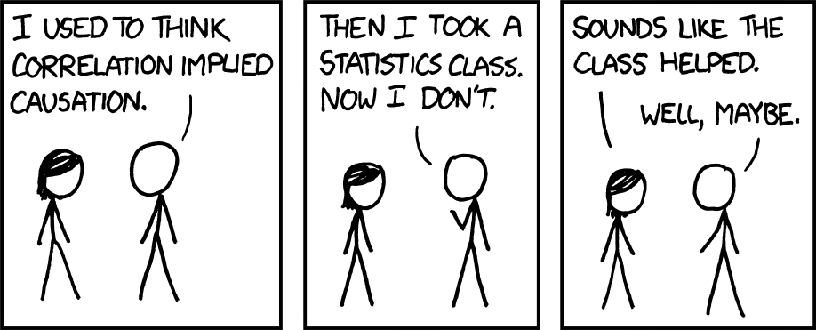
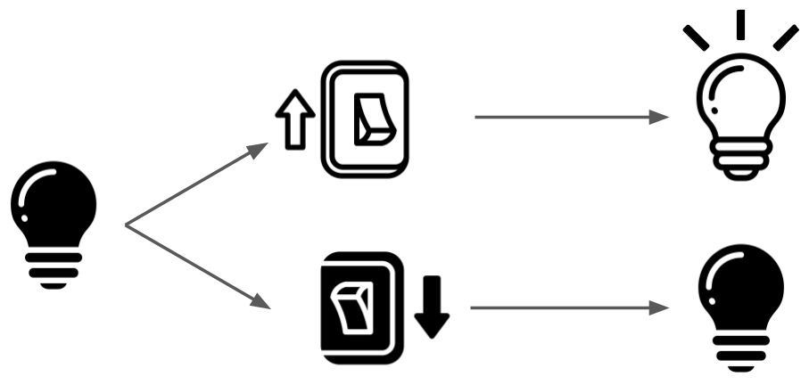

::: content-hidden


```{r}
set.seed(0)
#| warnings: false
library(tidyverse)
library(magrittr)
```
:::

# Counterfactuals

Besides satisfying curiosity, the purpose of scientific inquiry is to enable us to make better choices. In situations where there are competing alternatives, we want to know which of them will lead to the best outcome. For example, should children get access to screens or does it hurt their mental health? Should we enforce laws more strictly in order to reduce crime? How much exercise should I get each week?

When we say that an action "causes" an effect in natural language, vaguely we mean that a) the effect occurs when the action is taken and b) the effect does not occur if the action is not taken. In this sense, causality is defined using a counterfactual contrast between two hypothetical worlds in which an action is either taken or it is not. 

A common misconception is that an action causes an effect if the effect is not present prior to the action but is afterwards. For example, if a light is off, and I flip the light switch and the light turns on, that means flipping the switch caused the light to turn on. The conclusion is true in this case, but the reasoning is not correct. It's easy to understand why the misconception exists because our world is filled with examples (like the light switch) where this reasoning appears to work.

::: {#fig-correlation}


From [xkcd.com/552](xkcd.com/552).
:::

Unfortunately, there are many more examples where this reasoning fails. Many people go to the hospital and then die -- does that mean that hospitalization causes death? Not quite. This is why we have to think of causality in terms of counterfactual future contrasts rather than pre-and-post contrasts. Flipping the light switch causes the light to turn on not because it is on after flipping the switch, but because it would *not* have been on *had the switch not been flipped*. The only reason the pre-post comparison appears to work in this situation is because the "switch off" future counterfactual happens to be accurately represented by the past state of the light.

::: {#fig-causal-light}


In the light switch example, we need to imagine a parallel universe where the light switch was not flipped. If there is a difference in the light between those two parallel universes, then the switch caused the light to go on. It is not enough that the light went on after flipping the switch in our own universe, since that could have been due to something else happening at the same time.
:::

Counterfactual causality also escapes the trap of recursively identifying causes. Instead of asking about the effect of flipping a switch on the light under a specific set of conditions, we could have asked "what causes the light to turn on?". At first blush, the answer is obvious: the switch. But wasn't it really the electrons that the switch allowed to flow that caused the light to shine? And didn't those electrons really only flow because coal was burned in a far-away power plant? And didn't that coal arise from the death of algae millions of years ago? And didn't you flip the switch only because you were born? It's hard to define when or how this web of causation started being truly relevant to the light turning. 

In natural language, social context does *a lot* of heavy lifting to define "cause". Naming the *causes of effects* is therefore hard without more formalities. On the other hand, it's easy to describe the *effects of causes* with counterfactual outcomes alone because we can specify many conditions as given at the time of the cause of interest (the electricity is on, someone was born who can flip the switch, etc.). This distinction was pointed out as early as 1843 by @mills.

Most of our scientific questions are about what action we should take. By the above reasoning, these questions are inherently causal. To answer them we have to contrast what *would* happen under each alternative, all other things held constant. We must, in some sense, *imagine* different worlds in which choices are made differently. As @what-if puts it, we must ask "what if...?".

## Limitations of Probability

By itself, the probabilistic framework presented in the previous chapter is incapable of describing or measuring causality. For example, if you were to look at the (true) joint probability distribution of hospitalization and mortality in some general population people, you would be guaranteed to find that those who are hospitalized have a higher rate of mortality (because sick people go to the hospital!). If you were to take this as evidence of causation, you would fall into the same trap that we described above. As has been said many times: correlation does not imply causation. 

The fundamental problem is that probability distributions over observed variables only describe patterns of co-occurence between those variables. They do not say anything about what *would have* happened to one variable *had* another variable been forced to some value. 

It's easy to be tricked into thinking otherwise because we often write probability distributions in a way that suggests mechanistic relationships. For example, let's say that for two variables $X$ and $Y$ we know for a fact that

$$
\begin{aligned}
X &\sim \norm(0,1) \\
Y &= X+ \norm(0,1).
\end{aligned}
$$

This makes it seem like nature first generates $X$, and subsequently uses that information to decide on the value of $Y$. Maybe we'd draw this informally using a diagram like $X \rightarrow Y$. If we wanted to know the causal effect of $X=0$ vs $X=1$ on $Y$, it seems natural to simply plug those values into the equation for $Y$, which would show that changing $X$ by one unit produces a one-unit causal effect on $Y$. 

But this is an illusion. Using the definition of conditional probability, the *exact same* probability distribution can also be written as

$$
\begin{aligned}
Y &\sim \norm(0,2) \\
X &= \frac{1}{2}Y+ \norm\left( 0, \frac{1}{2} \right),
\end{aligned}
$$

which we might think to draw with an arrow in the opposite direction, $Y \leftarrow X$! Or, finally, we could write

$$
\left[
\begin{array}{c}
X \\ Y
\end{array}
\right]
\sim 
\norm\left(
\left[
\begin{array}{c}
0 \\ 0
\end{array}
\right]
,
\left[
\begin{array}{cc}
1 & 1 \\ 1 & 2
\end{array}
\right]
\right).
$$ {#eq-joint}

::: {.callout-note collapse="true"}
# Proof
I hope that you remember enough probability that these equivalences make sense to you, but there is no shame in needing a little refresher. If this argument seems unfamiliar to you, though, you should go back and review a calculus-based probability book or lecture series before proceeding. While the algebraic details are not really important, you should intuitively understand the relationship between conditional, joint, and marginal probabilities and how these are often written as above.

The statement

$$
\begin{aligned}
X &\sim \norm(0,1) \\
Y &= X+ \norm(0,1).
\end{aligned}
$$

is just shorthand for

$$
\begin{aligned}
p(x) &= \frac{1}{\sqrt{2\pi}} e^{-x^2/2} \\
p(y|x) &= \frac{1}{\sqrt{2\pi}} e^{-(y-x)^2/2}.
\end{aligned}
$$

By the definition of the conditional density, $p(y,x) = p(y|x), p(x)$, so multiplying gives the joint density

$$
p(y,x) = \frac{1}{2\pi} e^{-\tfrac12 (y^2-2xy+2x^2)},
$$

which is the joint density of the multivariate normal

$$
\left[
\begin{array}{c}
X \\ Y
\end{array}
\right]
\sim 
\norm\left(
\left[
\begin{array}{c}
0 \\ 0
\end{array}
\right]
,
\left[
\begin{array}{cc}
1 & 1 \\ 1 & 2
\end{array}
\right]
\right).
$$

That proves the equivalence between the $X \rightarrow Y$ representation and the joint $(X,Y)$ representation. Now we prove that the $X \leftarrow Y$ representation is also equivalent to the joint.

Using the definition of conditional probability we now condition in the opposite direction: $p(x|y) = \frac{p(y,x)}{p(y)}$, which requires us to know the marginal distribution of $y$. For this we simply integrate $p(y) = \int p(y,x),\dd x$ , marginalizing out $x$. Applying this to the joint density above gives

$$
p(y) = \frac{1}{\sqrt 2 \sqrt{2\pi}} e^{-\tfrac12\left(\frac{y}{\sqrt 2}\right)^2},
$$

which is the density of $\norm(0, 2)$. Dividing, we get

$$
p(x|y) = \frac{p(y,x)}{p(y)} = \frac{1}{\sqrt{1/2} \sqrt{2\pi}} \exp\left\{-\tfrac12\left(\frac{x-\tfrac{y}{2}}{\sqrt{1/2}}\right)^2\right\},
$$

which is the density of $\norm(y/2, 1/2)$. Therefore

$$
\begin{aligned}
Y &\sim \norm(0,2) \\
X &= \frac{1}{2}Y+ \norm\left( 0, \frac{1}{2} \right).
\end{aligned}
$$

:::

::: {#fig-bayes-rule}

``` {r}

n = 1000
# 1) "Forward" X-> Y view
gen_xy_forward = tibble(
    X   = rnorm(n, 0, 1),
    Y   = X + rnorm(n, 0, 1)
)

# 2) "Backward" X <- Y view
gen_yx_backward = tibble(
    Y   = rnorm(n, 0, sqrt(2)),
    X   = 0.5 * Y + rnorm(n, 0, sqrt(0.5))
) 

# 3) "Joint" (X, Y)  view
gen_xy_joint = MASS::mvrnorm(
    n, 
    mu = c(0, 0), 
    Sigma = matrix(c(1, 1, 1, 2), nrow = 2)
) |> 
    as_tibble() |> 
    set_names(c('X','Y'))

df <- bind_rows(
  list(
    "Forward: Y = X + ε"       = gen_xy_forward,
    "Backward: X = Y/2 + ε"    = gen_yx_backward,
    "Joint: (X,Y) ~ N(0,Σ)"    = gen_xy_joint
  ),
  .id = "View"
) |>
  mutate(View = factor(View, levels = c("Forward: Y = X + ε",
                                        "Backward: X = Y/2 + ε",
                                        "Joint: (X,Y) ~ N(0,Σ)")))

ggplot(df, aes(X, Y)) +
  geom_point(alpha = 0.35, size = 0.8) +
  facet_wrap(~ View, nrow = 1) +
  coord_equal() +
  labs(title = "Same joint distribution, three factorizations",
       x = "X", y = "Y") +
  theme_minimal(base_size = 12)
```

The code that generates the three dataframes above reflects the three different ways of writing the joint distribution in @eq-joint. Scatterplots of the three dataframes verify that they represent the same distribution despite the superficial dissimilarity of the code.
:::

These three representations correspond to the factorizations of the joint distribution that one can always obtain via the definition of a conditional distribution:
$$
\p(Y|X)\times \p(X) = \p(Y,X) = \p(Y) \times \p(X|Y).
$$

None of these is mathematically more correct or incorrect than any of the others. However, for this discussion, the joint representation of @eq-joint is the most *morally* correct because it's harder to misinterpret it as representing a causal relationship in either direction. To avoid being fooled, it helps to think in terms of joint probability distributions even if you see them written in a conditionally factored way.

While it's clear that in the $X \rightarrow Y$ representation the "causal" effect on $Y$ can be read off of the equation $Y = X + \dots$, for the other two representations it's not so obvious how to extract an effect of $X$ on $Y$ that feels "causal". In fact, the $X \leftarrow Y$ representation makes it seem like $Y$ is causing $X$ and not the other way around. 

For the $(Y,X)$ and $X \leftarrow Y$ representations our only option is to look at values of $Y$ among observations where $X$ takes one value and then among observations where $X$ takes another and compare. That is, we'd compare the distributions $\p(Y|X=1)$ and $\p(Y|X=0)$, which is nothing other than taking some measure of correlation between observed $X$ and observed $Y$. If you want to think of $\p$ as a large "population dataset", we're simply subsetting to the rows where $X=1$ and then $X=0$ and comparing the histogram of $Y$. We know that doesn't always represent a causal effect: we could easily end up saying that hosptialization causes death because more people die in the hospital.

In fact, we're doing the exact same thing with the $X \rightarrow Y$ representation, even though it seems like somehow we are mechanistically intervening on $X$ based on the way we've written the distribution. This is the illusion of causality that is created by writing a distribution in a way that appears mechanistic.

The comparison between the $X \rightarrow Y$ and $X \leftarrow Y$ representations is particularly jarring to some people, especially if $X$ and $Y$ are variables that are in fact known to have a temporal relationship. For example, perhaps $X$ is the concentration of a compound in some solvent and $Y$ is a noisy measurement. Clearly the value of the measurement does not change the chemical properties of the solution, but yet we can write our probabilistic model of the observations in a way that makes it seem like it does. 

Again, this is an illusion. Distributions don't know anything at all about chemistry, measurements, or even time. They do not care about whether $X$ or $Y$ came first in the physical world. They merely represent the rates of co-occurence between different values of the variables across a hypothetically infinite number of observations. Nothing more and nothing less.

I've presented my argument in terms of a distribution with two variables $X$ and $Y$ but absolutely nothing changes if we talk about distributions over more than two variables. Any probability distribution over $Z_1 \dots Z_p$ can be factored like

$$
\p(Z_1 \dots Z_p) = \prod_j \p(Z_j| Z_{j-1} \dots Z_1)
$$

and the ordering of the variables doesn't matter. We can reverse the roles of $Z_1$ and $Z_p$ or any other two variables and get a different, but equivalent factorization. In other words, we can always write the distribution in a way that makes it look like some variables are "upstream" and others are "downstream" when in reality the probability distribution is expressing no such temporal or causal concepts.

:::: {.callout-important appearance="minimal"}
::: {#exr-joint-factorization}
Let 
$$
\left[
\begin{array}{c}
X \\ Y \\ Z
\end{array}
\right]
\sim 
\norm\left(
\left[
\begin{array}{c}
0 \\ 0 \\ 0
\end{array}
\right]
,
\left[
\begin{array}{ccc}
1 & 1 & 0\\ 1 & 2 & 1 \\ 0 &1 & 1
\end{array}
\right]
\right).
$$

Write this distribution like
$$
\begin{aligned}
Y &\sim \dots \text{(some marginal distribution)} \\
Z &= \dots \text{(some function of Y and maybe noise)} \\
X &= \dots \text{(some function of Y and Z and maybe noise)},
\end{aligned}
$$

i.e., in a way that reflects the factorization 

$$
\p(X, Y, Z) = \p(X|Z,Y) \times \p(Z|Y) \times \p(Y).
$$

This just takes algebra so it's fine if you use a language model to do it. What's important is that you understand how it is done and get the idea that you can switch the roles of $X$, $Y$, and $Z$ and get a different, equally valid factorization.

:::
::::

## Potential Outcomes

The "problem" with probability isn't actually a problem with probability itself, but with what we are applying that formalism to. If we only model the variables we can actually observe (that is, values in our own universe) then we have no language with which to describe *counterfactual* values: the essential ingredient of causality.

The solution is simple: include the counterfactual values as variables in the probability distribution. The system we describe below to formalize causal questions is called the *Rubin* causal model, the *Neyman-Rubin* causal model, or simply the potential outcomes causal model.

Potential outcomes are easiest to explain in the context of an example. Presume we're interested in the causal effect of a new drug vis-a-vis an older, standard drug on how long patients survive an aggressive form of cancer. Would patients survive longer on average on the new drug or on the old drug? The answer to this question has an obvious implication on policy: doctors should generally prescribe whichever drug is best for survival, assuming that is the patient's objective.

Suppose we have access to a large database of cancer patients, which, for each patient, records:

* **Covariates** ($X$): Information present at the time of diagnosis, such as age, chromosomal sex, disease status, etc.
* **Treatment** ($A$): Which drug was prescribed (new or old) at the time of diagnosis
* **Outcome** ($Y$): Surival time after diagnosis

We can represent this as a typical dataset with $n$ rows.

::: {#tbl-obs .sm .bordered .w-50 .mx-auto}
| $i$ | $X$ | $A$ | $Y$ |
| --- | --- | --- | --- |
| 1 | 85 | 0 | 3          |
| 2 | 88 | 1 | 6          |
| 3 | 72 | 0 | 4          |
| ... | ... | ... | ... |
| n | 59 | 1 | 4          |

The observable dataset.
:::

Here I've simplified the covariates $X$ to a single variable (age, if you like) for ease of display, but you can just as easily imagine multiple columns $X_1 \dots X_d$. The treatment $A$ is a binary random variable with value $1$ if the new drug was given and $0$ if the old drug was given. The outcome $Y$ represents post-diagnosis survival time (e.g., in months). In line with our probabilistic setup we imagine that each row in this table is an IID draw from a joint distribution $\p(Y,A,X)$.

The problem we identified with this setup earlier is that the distribution $\p(Y,A,X)$ contains no information about the outcome that *would have* been observed for an individual *had* they been treated with the new or old drug, contrary to fact. To fix this, we simply define those two "what-if" outcomes as separate random variables $Y(0)$ (corresponding to the $A=0$ "what-if") and $Y(1)$ (corresponding to $A=1$) respectively. These variables are referred to as the *potential outcomes* or *counterfactuals*. If we could see a dataset that contained observations of both potential outcomes for each patient it would look like this:

::: {#tbl-causal .sm .bordered .w-50 .mx-auto}
| $i$ | $X$ | $A$ | $Y(0)$ | $Y(1)$ |
| --- | --- | --- | --- | --- |
| 1 | 85 | 0| **3** | 5 |
| 2 | 88 | 1 | 2 | **6** |
| 3 | 72 | 0 | **4** | 5 |
| ... | ... | ... | ... | ... |
| n | 59 | 1 | 3 | **4** |

The *causal* dataset.
:::

In some literature @tbl-obs is called the "science table", but I'll just call it the "causal data" or "counterfactual data". We imagine that these data would be drawn from a distribution $\p^*(Y(1), Y(0), A, X)$ that we call the *causal* distribution (you can also think of this as a causal dataset with infinite rows). I'll use the asterisk on probability distributions to show when they are defined over unobservable variables like potential outcomes.

It helps me to think of the potential outcomes as pre-determined. For each person, I imagine that their futures under either drug are already set in stone, or that they have already played out in some other universes. The values of the potential outcomes $Y(1)$ and $Y(0)$ simply record the survival times in those two predestined futures. They both already exist before a treatment has even been prescribed. In other words, they are not temporally or mechanistically linked to the *observed* value of the treatment $A$, the decision that is made in *our* universe. The causal distribution $\p^*$ describes pure co-occurences between all these variables in the "multiverse".

Although we call it "causal", there is nothing special about a causal distribution: it is a standard probability distribution over the four separate random variables $Y(1)$, $Y(0)$, $A$, and $X$. Although the notation $Y(1)$ and $Y(0)$ for the potential outcomes makes these variables look a little different, they are just regular random variables. We could just as easily name them as $Z$ and $W$. The parenthetical notation $Y(a)$ (for $a$ some fixed value that $A$ takes) is meant to evoke the fact that the potential outcome $Y(a)$ is a "version" of the outcome $Y$ indexed by a possible treatment $a$. Other authors use subscripts or superscripts instead so you'll also see $Y_a$ and $Y^{(a)}$ throughout the literature. I personally prefer the parentheses so that sub/superscripts can be used for other purposes and so that the treatment value $a$ is more clearly visible.

Now that we've defined the potential outcomes for our problem we can clearly write down our scientific question. Recall that we wanted to know whether patients survive longer on the new drug or on the old drug. Since we've now defined the potential outcomes as each individual's survival time on either the new or old drug, the question comes down to comparing $\E_{\p^*}[Y(0)]$, the average survival time if everyone got the old drug, to $\E_{\p^*}[Y(1)]$, the average survival time if everyone got the new drug. In what follows I'll usually omit the subscript on $\E_{\p^*}$ since when you see potential outcomes being averaged over you should automatically know that the average is with respect to the causal distribution.

The first problem in calculating either $\E[Y(1)]$ or  $\E[Y(0)]$ is the standard problem of statistical inference: we don't have access to the entire population, only a sample. In other words, we don't have all the "rows" of data we'd like. But we know how to deal with this. If we had access to a *causal* dataset like the one shown above, a natural way to way to estimate $\E[Y(a)]$ (for either $a=0$ or $a=1$) would be to use a sample mean $\frac{1}{n}\sum Y(a)$. Notice that the values of the *observed* treatment and covariates are irrelevant if we have access to causal data!

### The Fundamental Problem

Unfortunately, we can *never* see causal data like what's in @tbl-causal. This is the second, and most important problem we encounter when attempting to calculate $\E[Y(a)]$. To observe $Y(0)$ (for patient $i=1$, for example) we'd have to have given that individual the old drug $A=0$ at diagnosis, but to observe $Y(1)$ we'd have to have given them the new drug $A=1$. Without some method of time travel, there is simply no way to see both potential outcomes for a single patient. We can usually deal with the problem of not having as many rows as we'd want, but it's harder to solve the problem of not having all the *columns* we'd want. This is called the *fundamental problem of causal inference*.

But just because we can never see the full causal data doesn't mean that the fundamental problem can't be worked around or that potential outcomes are useless. Quite the opposite! Writing down the potential outcomes allows us to precisely pin down our causal question, figure out what the exact problem we're facing is, and communicate clearly about assumptions we might need to overcome it. Potential outcomes are completely imaginary, but they are a useful fiction in the same way that the entire edifice of probability theory and mathematics is.

### What is a Cause?

> Constantly regard the universe as one living being, having one substance and one soul... and how all things act with one movement; and how all things are the co-operating causes of all things which exist; observe too the continuous spinning of the thread and the contexture of the web. --- *Meditations*, Marcus Aurelius

Philosophers and scientistis have been debating causality for millenia. Most of these debates are academic, but there are a few issues that are relevant for the practice of causal inference. In this section we'll discuss what can or should be thought of as a "cause" and what the implications are when framing causal questions. The discussion here is brief, so I recommend digging into the references I cite along the way.

Shortly after the formalization of the potential outcomes framework, @holland argued that in order for a potential outcome to exist there must actually be a (hypothetical) real-world scenario in which that potential outcome could be observed. This position is referred to as the "interventionist" perspective because for something to be a "cause" it must correspond to an intervention that, in principle, could be enacted to observe a desired potential outcome. The position is concisely summarized by the maxim: "*no causation without manipulation*", coined by Donald Rubin and Paul Holland [@holland]. 

In considering whether to give the new or old drug to our cancer patients, we could very easily have given any patient either drug in a hypothetical experiment. It's clear what real-world steps could have been taken to make this happen. But in other cases it's not so obvious. You can certainly say something like "Susan would get paid more if she were a man" or "Justin wouldn't have been pulled over if he were white". But what is the theoretical mechanism by which Susan could have possibly been a man or by which Justin could have been white? By this argument, something like "sex" or "race" cannot be a cause of anything because the relevant counterfactuals don't make sense.

To some extent, these problems can be solved by using more precise language. Perhaps Susan would have been offered a higher salary if she had put a man's name on her resume -- we can easily imagine an experiment where participants obscure their gender identities from employers. Perhaps Justin would not have been pulled over if he had tinted windows in his car. Perhaps Susan would be paid more if, in utero, we had performed an as-yet undiscovered procedure to exchange X and Y chromosomes. But none of these is the same as "the causal effect of sex" or "the causal effect of race" -- those remain undefined because the concepts of "sex" and "race" are actually themselves not well-defined! 

The interventionist position is useful because it forces us to think more carefully about our questions so that they address choices we can actually make in the real world. If we *were* to say that sex had a causal effect on wages, what is the meaningful action that we could take to acheive pay equality? It's not obvious. On the other hand, by thinking in terms of policies and actions (e.g., effect of gender-blinded interviews) rather than vague categories (e.g., effect of sex) we can ensure that the implications of research are more clear [@vanderweele2016commentary]. 

On the other hand, there is always a tradeoff between generality and specificity. As a causal question becomes more specific, it often becomes more "interventionist" (as seen above). However, a more specific causal question is also less general and thus less useful. Maybe we don't care specifically about the effect of changing a name on a resume or any other feasible intervention because we don't think any of these things in any easily-enumerable combination would actually move the needle on an socially entrenched problem like structural racism or sexism [@glymour2014commentary; @kaufman2019commentary]. 

Moreover, perhaps we should be able to talk about "attributes" as possible causes because the point may not be to identify a solution but to measure the scale of a problem. The interventionist retort is that racism and sexism (or obesity, poverty, etc.) are already widely understood to be problems. One more quantitative argument to that effect isn't going to change how things are, but understanding concrete interventions might. As a compromise, @pearl2019interpretation suggests that causal effects on vague or nonintervenable factors can still be usefully interpreted as an upper bound on any effect that could be achieved with a practical intervention. 

In most cases there is a spectrum of possible causal questions that range from hyper-specific and interventionist to extremely vague and non-interventionist (see @hernan2016does for good examples). There is no point at which the "cause" of interest suddenly becomes objectively intervenable -- it is ultimately always a matter of subjective opinion where to draw that line. @rubin1986comment discusses hypothetically removing the sun from the solar system!

Another argument against interventionism is that it denies physical causality. Taken to its extreme, the interventionist position implies that a statement like "objects fall because of the Earth's gravity" actually has no causal content since there is no conceivable intervention by which we might remove gravity from the Earth. In fact, the maximal interventionist position necessarily implies that "causation" didn't even exist before there were humans to make choices (otherwise who is doing the intervening?) [@bollen2013eight]!

While much has been made of this debate, the two sides are largely in practical agreement. Even prototypical exponents of interventionism like @rubin1986comment and @vanderweele2016commentary clearly acknowledge that there can be some utility in ascribing causality to social attributes or even physical phenomena. On the opposite side, non-interventionist viewpoints like @kaufman2019commentary and @pearl2019interpretation easily concede the fact that thinking in terms of possible interventions helps keep research actionable. It's more helpful to think of these two positions as conceptual poles on a spectrum than as two different camps of people.

This working consensus also makes sense if you agree that "causality" as we are discussing it is just a social construct that helps facilitate decision-making. It's a hard thing to wrap your head around, but causality itself need not be physically well-defined outside of language! Even if you believe in some modern physical theory like string theory or quantum loop gravity as "Truth", the concepts of causality in those systems are so mind-bendingly distant from human experience as to be useless [@causal-cone; @quantum-loop]. They have nothing to do with choices or "what-ifs". 

If counterfactual causality or even causality writ large are just useful fictions, then there is no need to be particularly dogmatic about whether potential outcomes can or cannot represent non-interventional scenarios. This cuts both ways. Those leaning towards interventionalism shouldn't drink so much of their own kool-aid that they start believing in the physical reality of potential outcomes. Those leaning against interventionalism shoudn't push back so hard that they insist on harmonizing counterfactual and physical causality. The focus should instead be on how to frame the causal question to best address the social-scientific need -- the best we can do is to be aware of the tradeoffs and context and use best judgement. 

### Causal Consistency

Let's return to the math. In our drug example we supposed the existence of potential survival times $Y(0)$ and $Y(1)$ under the old and new drugs for each patient. In that context, the question of which drug would yield the longest survival time on average if given to everyone reduces to comparing $\E[Y(0)]$ and $\E[Y(1)]$. But, unfortunately, we cannot compute either of these (even with infinite "rows" of data) because we only observe, at best, *either* $Y(0)$ *or* $Y(1)$ for each person, depending on which drug they actually received. That's the fundamental problem of causal inference.

But things are not entirely hopeless because we generally do have *some* insight into the potential outcomes. In the causal data table I've marked some of the potential outcome values in bold. These are the values of the outcome that are actually observed. You can see this more clearly by concatenating the observed and causal datasets:

::: {#tbl-concat .sm .bordered .w-50 .mx-auto}
| $i$ | $X$ | $A$ | $Y$ | $Y(0)$ | $Y(1)$ |
| --- | --- | --- | --- | --- | --- |
| 1 | 85 | 0 | 3          | **3** | 5 |
| 2 | 88 | 1 | 6          | 2 | **6** |
| 3 | 72 | 0 | 4          | **4** | 5 |
| ... | ... | ... | ... | ... | ... |
| n | 59 | 1 | 4          | 3 | **4** |

The observable dataset with potential outcomes concatenated. 
:::

The observed outcome column $Y$ is an interleaving of the potential outcome columns $Y(1)$ and $Y(0)$ according to the value of the observed treatment $A$. In a programming language with vector indexing, this might be coded like `Y[A==1] = Y1[A==1]` and `Y[A==0] = Y0[A==0]`. Mathematically, we can write $Y = A\times Y(1) + (1-A)\times Y(0)$ or, even more to the point, $Y = Y(A)$, exploiting the potential outcomes notation. In words: the observed outcome is whichever *potential outcome* corresponds to the *observed treatment*. 

The statement $Y = Y(A)$ is referred to as the *causal consistency* assumption, but whether or not $Y= Y(A)$ is actually an "assumption" is a matter of perspective. Since we are in control of how the potential outcomes are defined we can always make this hold at the cost of redefining our causal question.

::: {.Exm #exm-trt-switching}
##### Treatment Switching
Let's say that, in our drug example, what we see as "$A$" in the patient records is what drug people were first prescribed, but some patients actually switched treatment after some time (e.g. they picked up the old drug for three months and then the new drug for the next three). Treatment switching like this is very common in health records data. If we interpret "$Y(1)$" to mean the survival we would have observed for a person had they been prescribed the new drug and actually taken it for the entirety of their care and "$Y(0)$" the same for the old drug, then $Y_i \ne Y_i(A)$ for any individual $i$ who either switches treatment or who doesn't actually take the drug they were prescribed.

The problem is that the treatment $A$ recorded in the data is not the same as the "$A$" we are interested in evaluating the effect of. But this is an unforced error because *we* are in control of how the potential outcomes are defined. If patients switch treatments or don't take their drugs, it doesn't make sense to pose the question we asked without modeling those processes. We should instead let the $A$ in $Y(A)$ reflect the $A$ as it is actually observed. In the drug setting we'd let $Y(1)$ be the survival time for anyone who was first prescribed the new drug, whether or not they took it or switched in the future, which corresponds to the definition of $A$ in the data we have. In that case, there is no "assumption" that $Y = Y(A)$ because we have defined $Y(a)$ so that this holds.

In the randomized trial literature, effects based on some initial prescription are often called "intent to treat" effects, since we cannot actually ensure that the treatment gets followed. This is in contrast to "per protocol" effects, which ask what the outcome would have been had the intended treatment actually been followed. The latter can actually be estimated under further assumptions but we will discuss this in the next chapter.
:::

Defining the potential outcomes from the version of treatment appearing in the data may not correspond to the question we *want* to ask, but it is the question we can safely attempt to answer with the data provided. If we deviate from that choice then causal consistency may be violated and the research question changes. 

In fact, it doesn't make sense to use the symbol "$A$" in $Y(A)$ to refer to something different than the observed $A$. If the intervention in the causal question of interest is truly different than the observed treatment then it should get its own, possibly unobserved, random variable $\tilde A$. That clarifies that we can take $Y = Y(A)$ by definition (perhaps even if $A$ is non-intervenable), but it may be that $Y(A) \ne Y(\tilde A)$. In fact, the notation is somewhat deficient in this setting because setting $A=1$ and $\tilde A=1$ gives the ungrammatical $Y(1) \ne Y(1)$ -- what we really mean is that $Y_A(1) \ne Y_{\tilde A}(1)$ or $Y(A=1) \ne Y(\tilde A=1)$.

In some cases, the precise meaning of $A=a$ can be implicit.

::: {.Exm #exm-drug-classes}
Presume that, in our drug example, there are actually many different "old" drugs that could have been prescribed. Suppose that a value of $A=0$ is recorded for any patient who is prescribed any of these old drugs, but we do not observe specifically which drug is given. 

In this case, the potential outcome $Y_i(A=0)$ might be naively interpreted as how long person $i$ would survive on any of the older drugs. This isn't quite right because someone's potential survival time on one old drug might be different than on another old drug so they can't be rolled into one number. 

The correct interpretation of $Y_i(A=0)$ is person $i$'s survival time if they were prescribed an old drug according to whatever mechanism patients and doctors use to select one of the old drugs when they are prohibited from using the new drug, assuming said prohibition does not change the relative probabilities of getting the other drugs [@vanderweele2013causal; @lee2024bridging].
:::

In @exm-drug-classes, we likely do not know the actual treatment mechanism by which doctors and patients are selecting drugs, so the "treatment" $A=0$ is only defined implicitly. However, it is defined, and we do have $Y = Y(A)$. 

Leaving the treatment defined implicitly isn't any worse of a transgression than letting the population of interest be implicitly defined, as it often is in much empirical work. There is always a tension between generality and specificity. Where the right tradeoff is depends on scientific context and mature judgement.

Long story short, the consistency assumption can always be made to hold by correctly defining the potential outcomes with reference to the observed treatment. However, this may make the result difficult to interpret or less scientifically meaningful. When this tension arises it is usually best resolved by more accurately modeling the treatment of interest, e.g. by adding in treatment adherence (or treatment type over time) and/or the specific drug prescribed as variables. Once those variables are defined we can more faithfully describe the interventions of interest. In the next chapter we'll learn how do this in a principled way.

## Overcoming the Fundamental Problem

Not being able to observe both potential outcomes for each individual seems like an insurmountable problem, but the fundamental problem of causal inference can actually be overcome in many different ways. The key in all cases is to have or assume some prior domain knowledge of the hypothetical causal distribution. The process of leveraging these assumptions to pinpoint a causal effect from observable data is called *causal identification*. We'll talk a lot more about causal identification later on but I'll give you a brief preview so you have an idea of where we're going.

Returning to our running example, suppose that the observed patient database was actually the result of running a *randomized trial*. Specifically, suppose we know for a fact that each patient's treatment (new or old drug) was determined by the result of a fair coin flip. With this additional knowledge, we can recover the average of potential outcomes $\E[Y(a)]$ under either treatment even though we only get to see the observed outcome $Y$. 

Letting either $a=1$ or $a=0$,

$$
\begin{aligned}
\E_{\p^*}[Y(a)] &= \E_{\p^*}[Y(a)|A=a] \\
&= \E_\p[Y|A=a] \\
\end{aligned}
$$

Neither of these equalities is immediately obvious if you're not familiar with potential outcomes so let's walk through them. 

The first equality is

$$
\E_{\p^*}[Y(a)] = \E_{\p^*}[Y(a)|A=a],
$$ 

which is the crucial step where we exploit our knowledge of the data-generating process. This equality holds because the randomization of the treatment $A$ makes it statistically independent of all other variables measured at or before that time. Since the potential outcomes are considered "pre-existing", $Y(a) \perp A$. By definition, then, $\p^*(Y(a)) = \p^*(Y(a)|A)$ which in turn implies $\E_{\p^*}[Y(a)] = \E_{\p^*}[Y(a)|A=a]$. 

Again, the *only* reason we can verify this equality is because we have existing knowledge about the data-generating process: in this case, the fact that treatment was randomized.

The second equality is more generic and follows from the causal consistency relationship between observed and potential outcomes. In the expression $\E_{\p^*}[Y(a)|A=a]$ we can replace $Y(a)$ by $Y(A)$ since the conditioning subsets to the observations where $A=a$. Now, by the definition of the observed outcomes in terms of potential outcomes we know $Y = Y(A)$, so we can replace $Y(A)$ by $Y$ to obtain $\E_\p[Y|A=a]$.

Even though it's only two lines, it's easy to get lost in the algebra and lose sight of what we've done. We started with the estimand $\E_{\p^*}[Y(a)]$, something defined in terms of potential outcomes, referencing expectation over a causal distribution $\p^*$ that we can't directly sample from and therefore cannot directly estimate.

But we ended with the estimand $\E_{\p}[Y|A=a]$ which is defined *purely in terms of observable quantities* from the observable distribution $\p$. This is something we *can* estimate! Given a finite sample, we'd simply take the sample average outcome in treatment group $A=a$. Since that is an unbiased estimate of $\E[Y|A=a]$, which is equal to our causal estimand $\E[Y(a)]$, it is also an unbiased estimate of the causal estimand. We have done causal inference!

It's useful to understand why, barring randomization, the average outcome among people taking the new drug ($\E[Y|A=1]$) might *not* be equal to the average outcome if *everyone* were to take the new drug ($\E[Y(1)]$). One scenario could be that the new drug is very expensive and therefore only ends up being taken by people with high income. These people are likelier to have better health in general or be diagnosed at an earlier stage of disease and therefore have longer survival times regardless of what drug they take. Essentially $\E[Y|A=1] \ne \E[Y(1)]$ because the subset of people on the new drug $A=1$ in the population is not representative of the general population. 

Randomization resolves the issue algebraically, as we have seen, but also intuitively because it ensures that the population treated with the new drug $A=1$ is statistically identical to the general population. If everyone has equal chance of getting either drug, there is no reason for either group to look systematically different from the overall population.

:::: {.callout-important appearance='minimal'}
::: {#exr-pot-outcomes}
Presume that, in reality, our new drug of interest works exactly the same as the old drug. In such a scenario, the potential outcomes under the new and old drugs would be identical for every person. Suppose further that anyone who is wealthy ($X=1$) would survive exactly 15 months regardless of treatment choice ($Y(1) = Y(0) = 12$) whereas anyone who is not wealthy ($X=0$) would only survive exactly 8 months regardless of treatment. In the population of interest, only 10% of people are wealthy. 70% of wealthy people take the new drug ($A=1$) and only 10% of the not wealthy take the new drug.

a. What are $\E[Y|A=1]$ and $\E[Y(1)]$? You can find these algebraically using total expectation.
b. Write a function in your programming language of choice that lets you sample $n$ rows of data from a causal data-generating process encoding this scenario. The easiest way is to write it such that the covariate $X$ is generated, then the treatment $A$ is generated based on $X$, and finally the potential outcomes $Y(0), Y(1)$ are generated based on $X$ and $A$.
c. Use your code to verfiy your result in the first part by setting $n$ very large and approximating $\E[Y|A=1]$ and $\E[Y(1)]$ with sample averages from over this "population" dataset.
d. Use your code to explore how $\E[Y|A=1]$ and $\E[Y(1)]$ change if you change the proportions of the wealthy and poor who take the new drug.
:::
::::


::: {.Exm #exm-identification-light-switch}
#### Light Switch
Before moving on, let's return to the light switch example and formalize exactly why the intuitive pre-post comparison appears to give the right answer about the switch causing the light to turn on. In that example, let $Y(1)$ be the state that the light would be in (on or off) had the switch been flipped up and let $Y(0)$ be the equivalent were the switch down. As covariates, let $X = [\tilde Y, \tilde A]$ represent the observed state of the light and switch *prior* to intervention and presume for simplicity that at baseline the switch and light are both off so $\tilde Y, \tilde A] = [0,0]$. 

After flipping the switch up ($A=1$), we obeserve the lgiht turn on ($Y=1$). By causal consistency, we know this is an observation of $Y(1)=1$. But by the fundamental problem, we have no knowledge of $Y(0)$, what *would* have happened if we had left the switch down. However *if we assume* that $Y(0) = \tilde Y$, i.e. that the state of the light would have been unchanged had we not flipped the switch up, then we can conclude that $Y(0) = 0$ and that the switch has a causal effect on the light since this is different than $Y(1)=1$.
:::

The light switch example illustrates the same principle as the randomized trial: if we know or assume something about the causal data-generating distribution, we can overcome the fundamental problem of causal inference. In the case of randomization, we know something about the mechanism of treatment assignment, whereas in the light switch example we assumed that lights don't randomly turn on and off. The takeaway is that we must always have some knowledge or make some assumption deemed sensible in the real world in order to overcome the fundamental problem: there is no purely data-driven approach to causal inference. 

In the coming chapters we'll discuss many other prior-knowledge scenarios besides randomized trials in which the fundamental problem can be overcome. But before getting to that we'll introduce a few more analytic tools in the next chatper that make it much easier to frame a problem and define relevant counterfactuals.

## History and Notes {.unnumbered .unlisted}

In the Western tradition, causality has been a topic of philosophical debate at least as far back as Aristotle [@aristotle-physics-ROT; @aristotle-metaphysics-ROT]. Counterfactual theories of causality have more immediate roots in @hume and @mills -- @holland gives a concise review of these texts. @neyman1923 gave the first account of counterfactuals in the language of statistics, although his presentation was limited to randomized experiments. Donald Rubin consolidated and extended this theory in a series of papers in the 70s starting with @rubin1974estimating. 
