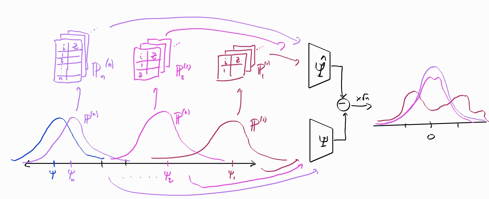

::: {.content-hidden}

```{r}
#| warnings: false
library(tidyverse)
```
:::

# Regularity 

While restricting ourselves to asymptotically linear estimators is a good start, unfortunately it is not quite enough to develop a sensible theory of optimality. In this section we'll first argue for why a further restriction is not only sensible but useful. Then we will come up with and refine a definition that suits our needs. 

## Hodges' Estimator

Let's presume we're interested in estimating the mean $\psi = \Psi(\mathbb P) = \mathbb E_{\mathbb P}[Z]$ from $n$ IID draws of a scalar random variable $Z$ that we know is normally distributed with standard deviation $\sigma=1$. Our statistical model is therefore $\mathcal P = \{\norm(\psi, 1): \psi \in \mathbb R\}$, a one-dimensional parametric model. Obviously this is a contrived example where we know a lot about $Z$, but the point is to show that even in this extremely favorable setting we can be led astray by mathematical arguments that put our attention in the wrong place.

We'll consider two estimators:
$$
\begin{aligned}
\hat\psi &= \frac{1}{n}\sum Z_i \\
\tilde\psi &= 
\begin{cases}
\hat\psi & |\hat\psi| > n^{-1/4} \\
0 & |\hat\psi| \le n^{-1/4}
\end{cases}
\end{aligned}
$$

The first estimator is just the usual sample mean. The second is what is called *Hodges' estimator*. When the sample is large, Hodges' estimator almost always returns the sample mean. But when the sample is small, Hodges' estimator often ignores the sample mean and returns zero.

Let's compare the asymptotic sampling distributions of the two. Since $Z$ are normal random variables with unit variance and mean $\psi$, we know that the sample mean has the exact distribution $\norm(\psi, 1 / n)$. Thus it follows that 
$$
\sqrt{n}(\hat\psi - \psi) \rightsquigarrow \norm(0, 1)
$$

::: callout-warning
If you are not familiar with convergence in distribution you should work through @sec-app-rv-convergence now.
:::

Hodges' estimator, however, has the following asymptotic distribution:

$$
\sqrt{n}(\hat\psi - \psi) \rightsquigarrow 
\begin{cases}
\norm(0, 1) & \psi \ne 0 \\
\norm(0, 0) & \psi = 0
\end{cases}
$$

::: {.callout-note collapse="true" appearance="minimal"}
# Derivation of the asymptotic distribution of Hodges' estimator
Let's prove that $\sqrt{n}(\tilde\psi - \psi) \rightsquigarrow \norm(0, 0)$ when $Z \sim \norm(0,1)$. This will require some understanding of what is meant formally by convergence in probability and a common probability tool called Chebyshev's inequality. It's not important to understand this proof if you're comfortable with the conclusion, I just provide it for completeness and as a refresher for those who are familiar with this kind of argument.

Since convergence in distribution and in probability are equivalent when the limit is a point mass (see @sec-app-rv-convergence), the statement is the same as saying that $\sqrt{n}(\tilde\psi - 0) \overset{\mathbb P}{\to} 0$. That's what we will prove. 

We can write Hodges' estimator as $\tilde \psi = 1(|\hat\psi| > n^{-1/4}) \hat\psi$. Then, for any $\epsilon > 0$,
$$
\begin{aligned}
\mathbb P\left\{|\sqrt n \tilde \psi| > \epsilon\right\} 
&= \mathbb P\left\{1(|\hat\psi| > n^{-1/4})|\hat\psi| > \epsilon/\sqrt n\right\} \\
&= \mathbb P\left\{|\hat\psi| > \epsilon \sqrt n \,\middle|\, |\hat\psi|>n^{-1/4}\right\}
\mathbb P\left\{|\hat\psi|>n^{-1/4}\right\} \\
&\le \mathbb P\{|\hat\psi|>n^{-1/4}\}
\end{aligned}
$$

by definitions and total probability. We can bound the last term by applying Chebyshev's inequality to the distribution of $\hat\psi$ and using the probability threshold $t=n^{-1/2}$:
$$
\mathbb P\{|\hat\psi|>n^{-1/4}\} = \mathbb P \left\{ |\hat\psi| - \mathbb E[\hat\psi] > n^{-1/4} \right\} \overset{\text{Cheb.}}\le \frac{\mathbb V[\hat\psi]}{n^{-1/2}} = \frac{1}{\sqrt{n}} \to 0
$$

where we used the fact that $\hat\psi = \frac{1}{n} \sum Z \sim \norm(0,1/n)$ when $Z \sim \norm(0,1)$.

This proves the desired convergence. Perhaps surprisingly, the proof still works if we are interested in proving that $r_n (\tilde\psi -\psi)$ converges in probability to 0 when the mean of $Z$ is zero for an arbitrary rate $r_n$. In other words, this convergence happens arbitrarily quickly as far as the asymptotics are concerned.

Nearly identical arguments are used to show that Hodges' estimator has the same asymptotic distribution as the sampling mean when the true mean is not zero. This is a fine exercise to try on your own to practice your probability theory.
:::

Like the sample mean, Hodges' estimator is definitely asymptotically linear: the influence function is 

$$
\phi_{\mathbb P}(z) = 
\begin{cases}
z - \mathbb E[Z] & \mathbb E[Z] \ne 0 \\
0 & \mathbb E[Z] = 0
\end{cases}
$$ 

which is certainly a $\mathbb P$-mean-zero $\mathcal L_2(\mathbb P)$ function for all $\mathbb P$ with finite mean of $Z$. Therefore if we were defining optimality among AL estimators, we would have to consider Hodges' estimator as a candidate.

::: {.callout-important appearance="minimal"}
::: {#exr-hodges-comparison}
Judging by the asymptotic distributions, do you think the sample mean or Hodges' estimator is better? 
:::
:::

The sample mean and Hodges' estimator are asymptotically the same across most distributions. But in any case where $\mathbb E[Z] =0$, Hodges' is clearly better: its variance goes to zero even if blown up by the square root of $n$ whereas the sample mean's variance does not. Therefore by these arguments Hodges' is the better estimator overall.

But if this is true, why do we use the sample mean instead of Hodges' estimator? And moreover why couldn't we reason the same way about a Hodges'-style estimator that has a special preference for some other value instead of zero? Wouldn't that estimator also be better than the sample mean for that special value and otherwise the same?

The reason we don't use Hodges' estimator is that the asymptotic arguments hide that this estimator actually performs much worse than the sample mean for most values of $n$ and most possible distributions of $Z$. You can see this in a simulation (or work it out analytically):

::: {#fig-hodges-efficiency}
```{r}
hodges = function(Z) {
    n = length(Z)
    ifelse(abs(mean(Z)) > n^(-1/4), mean(Z), 0)
}

sim = function(n, psi) {
    Z = rnorm(n, mean=psi)
    tibble(
        n = n,
        psi = psi,
        mean = mean(Z), 
        hodges = hodges(Z)
    )
}

params = expand_grid(
    n = c(10, 100, 1000), 
    psi = seq(-1,1, 0.01),
) 

1:100 |> # this many times,
    map_df(~pmap_df(params, sim)) |> # repeat sim() for each set of params
    group_by(n = factor(n), psi) |>
    summarize(
        mse_mean = mean((mean - psi)^2),
        mse_hodges = mean((hodges - psi)^2),
        efficiency = mse_hodges / mse_mean
    ) |> 
ggplot() +
    geom_line(aes(psi, efficiency, color=n)) +
    labs(x = expression(psi)) +
    theme_bw() +
    scale_y_continuous(
      breaks = function(limits) {
        b <- pretty(limits)            # the usual pretty breaks
        sort(unique(c(b, 1)))          # but force in 1
      }
    ) +
    geom_hline(
      yintercept = 1,
      colour     = "black",
      linetype   = "dashed"
    )
```
Relative efficiency of Hodges' estimator relative to the sample mean across $\psi$ for a few values of $n$.
:::

The $y$-axis of @fig-hodges-efficiency shows the relative efficiency of Hodges' estimator, defined as the ratio of MSEs between Hodges' estimator and the sample mean: $\mathbb E[(\tilde\psi - \psi)^2]/\mathbb E[(\hat\psi - \psi)^2]$. If this is greater than one, then Hodges' estimator is better than the sample mean, if less than one, it is worse.

As you can see, regardless of what $n$ is, Hodges' estimator is worse (and sometimes *much* worse) than the sample mean for the majority of the plotted values of $\psi$. So then why do the asymptotic arguments suggest that Hodges' estimator is actually better than the sample mean? 

The problem is that the asymptotics are only concerned with the behavior of each estimator at any particular distribution of $Z$. In our contrived model, the distributions of $Z$ are all normal with unit variance so a single distibution corresponds to a value of $\psi$. If you look at a single nonzero point on the $x$-axis (say, $\psi = 1/2$) and compare the relative efficiency as $n$ increases you'll see that it does converge to 1: both estimators are asymptotically equivalent. At the point $\psi=0$, however, the relative efficiency converges to 0 meaning that Hodge's estimator is infinitely more efficient at that point asymptotically. We can repeat our simulations but plot them a little differently in order to see this. Instead of plotting efficiency against $\psi$ and slicing by $n$, we'll instead plot efficiency against $n$ and slice by $\psi$ (you could imagine a 3D plot with efficiency on the z-axis and $n$ and $\psi$ on the x and y).

::: {#fig-hodges-efficiency-2}
```{r}
params = expand_grid(
    n = seq(1, 1000, by=20),
    psi = c(0, 0.25, 0.3, 0.5)
) 

result = 1:100 |> 
    map_df(~pmap_df(params, sim)) 
    
result |>
    group_by(n = n, psi = psi) |>
    summarize(
        mse_mean = mean((mean - psi)^2),
        mse_hodges = mean((hodges - psi)^2),
        efficiency = mse_hodges / mse_mean
    ) |> 
ggplot() +
    geom_line(aes(n, efficiency, color=factor(psi))) +
    labs(color=expression(psi)) +
    theme_bw() +
    scale_y_continuous(
      breaks = function(limits) {
        b <- pretty(limits)            # the usual pretty breaks
        sort(unique(c(b, 1)))          # but force in 1
      }
    ) +
    geom_hline(
      yintercept = 1,
      colour     = "black",
      linetype   = "dashed"
    )
```
Relative efficiency of Hodges' estimator relative to the sample mean across $n$ for a few values of $\psi$.
:::

In @fig-hodges-efficiency-2 you'll see that the bad behavior of Hodges' estimator is temporary for each value of $\psi \ne 0$. As $n$ increases, the estimator eventually behaves like the sample mean. Since the asymptotics don't care about any initial behavior of the sequence, they completely ignore the fact that Hodges' estimator is usually much worse than the sample mean because those problems are "temporary" as far as the behavior at any fixed distribution is concerned. 

The issue with that is that is that the problem doesn't actually disappear, it just goes to another distribution! As you can see in our first plot, the region of bad behavior simply moves as we increase $n$. If you're standing still at a given $\psi \ne 0$ you'd think everything is fine, but if you look across all values of $\psi$ you notice that we're just moving the problem around. That is precisely what the asymptotic arguments ignore: they are incapable of looking at the behavior of each estimator *at multiple distributions simultaneously*. They only consider a single distribution at a time. We call this *pointwise* asymptotic behavior because we're looking at each "point" (distribution) $\mathbb P$ in the model $\mathcal P$ one-at-a-time. Once we look across all values of $\psi$ at the same time, it's clear that Hodges' estimator is much worse than the sample mean. 

Asymptotic linearity is only concerned with pointwise convergence, but to prevent the bad behavior of Hodges' estimator we need some kind of *uniform* convergence: we'd like the sampling distributions of the estimates at each $\mathbb P$ to "arrive" or "approach" their limits at the same time. Physically you can imagine flattening a marshmallow: if you push down at a point on the marshmallow (e.g. by squeezing it between your thumb and index finger), the mass will can just go elsewhere. But if you sandwich it between your palms, you ensure that it gets squeezed down everywhere at the same time. That's "uniform" convergence.

::: callout-warning
See @sec-app-uniform-convergence for the definition of uniform convergence of functions. This is a common type of convergence that we often want to generalize for other kinds of objects. In what follows we will present a notion of "uniform" convergence in distribution for random variables.
:::

Estimators like Hodges' estimator are called _superefficient_ for reasons that will be explained in a few sections' time. In general, superefficient estimators perform better than other estimators on some very small set of distributions at the cost of abitrarily bad performance that moves around over the other distributions as $n$ increases. We want to rule out that sort of behavior so that we can compare estimators asymptotically without getting burned by their finite-sample behavior.

## Regularity in a Parametric Model

We've identified a problem with looking only at AL estimators: there are always AL estimators that look good in terms of their pointwise asymptotics but are actually bad because they just move the problem around in a way that makes it invisible to the asymptotics. 

To rule this out, we'll impose an addition condition called _regularity_. Informally, regularity means that the estimator approaches its limit distribution in a (locally) uniform way across the model so that asymptotics can't hide bad performance that moves around the model. 

We will start with a toy definition of regularity that we will build up to the formal definition in the next few sections. That will require us to introduce and explain a few abstractions but these will also come in handy later so it's worth doing. For now, though, here's a first draft:

::: callout-note
# Regularity in the Normal Location Model
::: {#def-regularity-1}
An estimator $\hat\Psi$ is *regular* in the model $\model = \{\norm(\psi, 1):\psi \in \reals\}$ if there is a single, fixed distribution $\mathbb D$ such that 
$$
\sqrt{n}\left( \hat\Psi(\p^{(n)}_n) - \Psi(\p^{(n)}) \right) \rightsquigarrow \mathbb D
$$ 
for *any* sequence of distributions $\p^{(n)} = \norm(\psi^{(n)}, 1)$ such that $\sqrt n (\psi^{(n)} - \psi) \to 0$.
:::
:::

First, let's clarify the notation. Since $\p_n$ is used to denote the (random) empirical distribution of $n$ draws from a distribution $\p$, I'm using superscripts to denote a sequence of (fixed) distributions $\p^{(1)}, \p^{(2)} \dots \p^{(n)} \dots$. In this convention, $\p^{(m)}_n$ would be the empirical distribution of $n$ draws from distribution $\p^{(m)}$.

Now we turn to @def-regularity. The first step in undestanding its meaning is to understand the following standard asymptotic statment which says that $\hat\psi_n = \hat\Psi(\p^{(n)})$ is a $\sqrt{n}$-asymptotically normal estimate of $\psi = \Psi(\p)$:
$$
\sqrt{n}\left( \hat\Psi(\p_n) - \Psi(\p) \right) \rightsquigarrow \norm(0, 1)
$$ 

For each sample size $n$, the left-hand side here is a random variable corresponding to the scaled and centered sampling distribution of the estimator, drawing the $n$ data points from the distribution $\mathbb P$. You can imagine standing still at the distribution $\p \in \model$: first drawing many datasets of size $n=1$ and passing them each through $\hat\Psi$ to generate the sampling distribution of $\hat\psi_1 - \psi$, then drawing many datasets of size $n=2$ to generate the distribution of $\hat\psi_2 -\psi$, etc. We're just (repeatedly) drawing larger and larger datasets from the same distribution to feed through the estimator and comparing the results to the estimand. The right-hand side says that those (centered and scaled) sampling distributions look more and more like the standard normal the larger $n$ gets.

Now compare that to our definition of regularity. The only difference is that instead of $\hat\Psi(\p_n)$ we have $\hat\Psi(\p^{(n)}_n)$ and instead of $\Psi(\p)$ we have $\Psi(\p^{(n)})$. What that means is that we are no longer necessarily "standing still" at a single distribution $\p \in \model$ while drawing larger datasets. Instead, we are typically *moving closer* to $\p$ as we increase the size of our draws. 

Concretely, we start at $\p^{(1)} = \norm(\psi^{(1)},1)$. We draw many datasets of size $n=1$ from $\p^{(1)} = \norm(\psi^{(1)},1)$ and pass them each through $\hat\Psi$, comparing the results $\hat\psi^{(1)}_1$ to the current ground truth $\psi^{(1)}$. Now we move to $\p^{(2)} = \norm(^{(2)}, 1)$. We draw many datasets of size $n=2$ from $\p^{(2)}$ and pass them each through $\hat\Psi$, comparing the results to the new ground truth $\psi^{(2)}$. We continue like this: at each $n$, we arrive at $\p^{(n)} = \norm(\psi^{(n)}, 1)$, draw many datasets of size $n$ from this distribution, and generate the sampling distribution of $\hat\psi^{(n)}_n - \psi^{(n)}$ comparing the current estimates to the current ground truth. 

{#fig-regularity-1}

::: {.callout-important appearance="minimal"}
::: {#exr-regularity-slow-seq}
Let's say that we have an estimator $\hat\Psi$ that is asymptotically normal when data are drawn $Z \sim \norm()$ with $\mathbb V_{\p}[\phi_{\p}(Z)] = 1$. However, 

:::
:::

::: {.callout-important appearance="minimal"}
::: {#exr-regularity-picture}
Draw a figure based on @fig-regularity-1 the depicts the standard asymptotic statement
$$
\sqrt{n}\left( \hat\Psi(\p_n) - \Psi(\p) \right) \rightsquigarrow \norm(0, 1).
$$
What parts of @fig-regularity-1 do you have to modify to accomplish this?
:::
:::

To summarize: the process in the definition of regularity is the same process as in the standard $\sqrt{n}$ asymptotic convergence statement. The only difference is that we're now allowed to shift the data generating distribution under the estimator and estimand rather than leaving it fixed. In the definition of regularity, however, the right-hand side must always be the same fixed distribution $\mathbb D$. In other words, no matter how we move the data-generating distribution around towards $\p$ while we increase the sample size, the estimator behaves more and more like it would if we stood still at $\p$. The fact that the limit is the same regardless of whether we're moving the ground truth distribution around (as long as it "converges" to the true distribution) is the key to regularity. Satisfying that property is what forces our estimator to have (locally) uniformly good convergence across distributions and prevents the bad behavior of Hodges' estimator. 

The fact that regularity is only concerned with sequences $\psi^{(n)}$ such that $\sqrt n (\psi^{(n)} - \psi) \to 0$ makes it more *lenient* than if we required the same kind of asymptotic convergence in distribution along *all* sequences $\psi^{(n)} \to \psi$. We want to a-priori rule out estimators whose bad performance will escape asymptotic detection, but we want to do this in the most lenient way possible so that we don't accidentally rule out some good estimators too. That's why we say that regularity enforces a kind of *local* uniform convergence in distribution: all the sequences of distributions we want to check still converge (quickly) to the distribution of interest. Another way to think of this is that the sequences we care about are all quickly shrinking perturbations of the distribution of interest.

::: {.callout-important appearance="minimal"}
::: {#exr-regularity-sample-mean}
Prove that the sample mean is a regular estimator at any distribution $\norm(\mu,1)$ according to @def-regularity-1:

a) If $\p$ is such that $Z_i \overset{\text{IID}}\sim \norm(\mu, \sigma^2)$ for any $\mu \in \reals, \sigma > 0$, what is the exact distribution of $\hat\Psi(\p_n) = \frac{1}{n} \sum Z_i$?
b) Using your answer from part (a), what is the exact distribution of $\sqrt{n}\left( \hat\Psi(\p_n^{(n)}) - \Psi(\p^{(n)}) \right)$ at any given $n$, assuming $\p^{(n)} = \norm(\psi^{(n)}, 1)$? What is the CDF $F_n(z)$ of this distribution at each $n$?
c) Recall that pointwise convergence of the CDFs is the definition of convergence in distribution (@def-conv-dist). Let $\sqrt n (\psi^{(n)} - \psi) \to 0$ (as examples you can try $\psi^{(n)} = \psi + \frac{1}{n}$ or $\psi^{(n)} = \psi$). Prove that under any such sequence, the sequence of CDFs $F_n(z)$ from part (b) converge at each point to the same limit $F_{\norm(0,1)}(z)$, the CDF of the standard normal. 

:::
:::

::: {.callout-important appearance="minimal"}
::: {#exr-regularity-hodges}
In a derivation above we proved that Hodges' estimator has excellent asymptotic properties if we stand still at $\p^{(n)} = \norm(0,1)$:
$$
\sqrt{n}\left( \tilde\Psi(\p_n^{(n)}) - \Psi(\p^{(n)}) \right) \rightsquigarrow \norm(0,0).
$$ 
Now we'll prove that Hodges' estimator is *not* a regular estimator according to this definition by showing that 
$$
\sqrt{n}\left( \tilde\Psi(\p_n^{(n)}) - \Psi(\p^{(n)}) \right) \rightsquigarrow \norm(0,1)
$$ 
if we move toward the true distribution like $\p^{(n)} = \norm(\frac{1}{n},1)$.

a) Presume that $\hat\psi \sim \norm(\mu,\sigma^2)$. Given that $\tilde \psi = 1(|\hat\psi| > n^{-1/4}) \hat\psi$, what is the CDF of Hodges' estimate $\tilde\psi$ for any value of $n$? It may help you to draw a picture of the "density function" for Hodges' estimator for some fixed $n$ (relative to the normal it has a spike at 0 comprised of the mass that was in the tails $|z|>n^{-1/4}$).
b) Using your answer from part (a), what is the exact distribution of $\sqrt{n}\left( \tilde\Psi(\p_n^{(n)}) - \Psi(\p^{(n)}) \right)$ at any given $n$, assuming $\p^{(n)} = \norm(\frac{1}{n}, 1)$? What is the CDF $F_n(z)$ of this distribution at each $n$?
c) Argue that this CDF $F_n(z)$ converges pointwise to the limit $F_{\norm(0,1)}(z)$, the CDF of the standard normal. 

Since the asymptotic distribution of Hodges' estimator is different depending on how we approach $\norm(0,1)$ with $\sqrt{n} \psi^{(n)} \to 0$ (standing still at $\psi^{(n)}=0$ or with $\psi^{(n)} = \frac{1}{n}$), we conclude that Hodges' estimator is not regular at this distribution.
:::
:::

The definition we're working with at the moment is specific to the normal model $\model = \{\norm(\psi, 1):\psi \in \reals\}$. We built a very specific sequence of distributions $\p^{(n)} = \norm(\psi^{(n)}, 1)$ that get closer and closer to the true distribution. Moreover we required the "distance" to the true distribution to close at faster than the $n^{-1/2}$ rate. Our challenge in the proceeding sections will be figuring out a sensible way to generalize our definition to nonparametric models. But to do that we'll first have to establish some notions of "geometry" in that setting.

## Paths and Scores

Our goal at our moment is to generalize our definition of regularity by establishing some "geometry" in our model so we can talk about a sequence of distributions converging in some required sense. In our current definition, a model $\model$ is just a set of distributions: there is no sense of direction or distance that is inherent to it. I think of a naked model like that as a big soup of distributions: everything is free to jumble around. We need a little more structure to make sense of regularity in a nonparametric model.

For the remainder of this section we'll work within models where every distribution $\p$ has a density function $p$. Formally, we will assume that all our distributions are absolutely continuous with respect to Lebesgue measure (don't worry if you don't know what that means). The results we will discuss actually do not depend on that assumption: the theory works exactly the same way for general models. However, the intuition is harder to get across in the general case, especially for readers who are new to measure-theoretic probability. I'll abuse notation where convenient and use $\model$ to refer to the set of densities $p$ as well as the set of distributions (measures) $\p$. If you know some measure theory, you can for now imagine that all distribuitons in the model have a density with respect to an arbitrary dominating measure $\bar{\p}$ and replace references to $\eltwo$ below with $\eltwo(\bar{\p})$. Throughout the rest of the book I will also write integrals like $\int f(z)\ p(z) \dd z$ with the standard differential $\dd z$ so that they are comprehensible without measure theory. If you know measure theory, you can replace these with Lebesgue integrals with respect to the relevant dominating measure.

The first step to imposing a structure that will be useful to us is to think in terms of density functions rather than distributions (measures). If all the elements of the model have densities, we can think of the model as a collection of densities. Since densities are functions, we might be tempted to say they are elements of $\eltwo$ because then everything is great: we have lengths, we have angles, we have all sorts of useful identities and relationships. But unfortunately that's not immediately possible. Recall @def-L2 that $\eltwo$ only includes functions that are square-integrable (have finite norm). However, there are some density functions for which $\int p(z) \dd z$ may blow up.

::: {#exm-non-L2-density}
The function $p(z) = \frac{1(0 < z <1)}{2\sqrt z}$ is a valid density because it is positive and integrates to one: 
$$
\frac{1}{2}\int_0^1 \frac{\dd z}{\sqrt z} = 1.
$$ 
But it is not square-integrable: the integral of its square is 
$$
\frac{1}{4} \int_0^1 \frac{\dd z}{z} = \infty.
$$

:::

::: callout-warning
We will be drawing on properties of $\eltwo$ substantially from here on out so this is a good time to work through @sec-app-L2-L2 if you haven't already.
:::

Thankfully, this is an easy problem to fix! Instead of working with the density functions directly, we can work with the *root densities*. Since $\int p \dd z = 1$, it's clear that $\int (\sqrt p)^2 \dd z = 1$. In other words, the square root of any density function is square-integrable and thus a function in $\eltwo$. Moreover, all of these root densities have unit norm in $\eltwo$! I'll use the symbol $\sqrt{\model} = \{\sqrt p : p \in \model\}$ to denote the collection of square roots of densities in the model. Because $\sqrt{\model}$ contains only positively valued functions with unit norm, we can visualize it as some subset of the unit ball in the "positive orthant" of $\eltwo$. In describing "orthants" I am drawing on the intuition described in @sec-functions-as-vectors where I imagine the "axes" of $\eltwo$ corresponding to the possible arguments of the function.

::: {#fig-sqrt-model}
``` tikz
\resizebox{12cm}{!}{
\begin{tikzpicture}

\pgfplotsset{compat=1.18}

  \begin{axis}[
    axis lines=middle,
    xlabel=$ $, 
    ylabel=$ $, 
    zlabel=$ $,
    xtick=\empty, ytick=\empty, ztick=\empty,
    view={50}{30},                % camera angle
    colormap/blackwhite,     % grayscale shading
  ]
 \node at (axis cs:0.05,0.05,0.15) {$\mathcal L_2$};

    \addplot3[
      surf,
      shader=flat,      % draws both smooth shading + facet edges
      fill opacity=0.8,           % only the surface is semi‐transparent
      draw=gray,                 % mesh‐lines in black
      very thin,                  % edge‐line thickness
      samples=15,                 % φ‐resolution
      samples y=15,               % θ‐resolution
      domain=0:90,                % φ from 0° to 90°
      y domain=0:90,              % θ from 0° to 90°
    ]
    (
      {sin(x)*cos(y)},            % x = sin φ cos θ
      {sin(x)*sin(y)},            % y = sin φ sin θ
      {cos(x)}                    % z = cos φ
    );
    \node[anchor=north east, color=gray] at (rel axis cs:0.125,0.125,0.8) {$\sqrt{\mathcal P}$};


    % great-circle arc (θ=45°) passing through P
    \addplot3[
      parametric,             % ← treat as a 1D parametric plot
      variable=\phi,          % ← name of the parameter
      domain=15:85,           % φ from 15° to 85°
      samples=25,             % number of points along the arc
      samples y=1,     % ← no second direction → no loop
      thick,
      orange,
      mark=none
    ]
    (
      {sin(\phi)*cos(45)},   % x(φ)
      {sin(\phi)*sin(45)},   % y(φ)
      {cos(\phi)}            % z(φ)
    );
    \node[anchor=north east, color=orange] at (rel axis cs:0.7,0.93) {$\sqrt{\mathcal P_\epsilon}$};

  \end{axis}
\end{tikzpicture}
}
\end{document}
```
The model $\sqrt{\model}$ embedded in $\eltwo$. In the drawing $\eltwo$ is represented as 3D space but this is not meant to be literal- this is a 3D cartoon representing infinite-dimensional space. The model is represented as the visible quarter section of the unit sphere. That part of the unit sphere represents all densities. If the model were restricted in some way (e.g. all zero-mean distributions), the model could be visualized as some subset of the shown surface.
:::

In addition to the model, in @fig-sqrt-model you can also see what we're going to call a *differentiable path* through the model. A path (also called a one-dimensional submodel) is intuitively what it sounds like: if you were standing at a point $p$ (or $\p$) in the model and you started walking in some direction, you'd be tracing out an example of a path. Formally, a path is a one-dimensional set of distributions in the model, parametrized by some $\epsilon \in \reals$. By "parametrized" I mean that every distribution in this set can be assigned a unique number $\eps$. If you consider $p_0$ (or $\p_0$) to be the "start" of the path, you can think of the parameter $\eps$ as encoding "how far" you are along the path (and perhaps in which direction). The density (or distribution) indexed by the particular number $\eps$ is often written $p_\eps$ (or $\p_\eps$). Paths are going to be very useful tools for us to define what we mean by distributions getting close to each other in a sense that is required for a general definition of regularity. Paths will also come up in many other places so it is worth taking some time to understand them here.

::: callout-note
# Path (1D Submodel)
::: {#def-path}
A *path* is any set of distributions $\model_\epsilon \subseteq \model$ that can be put into 1-to-1 correspondence with any subset of the reals. 
:::
:::

::: {#exm-path-convex}
Presume the model is the set of all continuous distributions. Pick any two points $p, p' \in \model$. Then the set of densities $\{p: p = \epsilon p' + (1-\epsilon) p\}$ is a path parametrized by $\eps \in [0,1]$. You can think of this as the straight-line path starting at $p$ (at $\eps=0$) and ending at $p'$ (at $\eps=1$). This is the canonical exmple of a path, which we will call a *convex path*.
:::

::: {#exm-norm-path}
Presume the model includes all normal distributions. Then the set of distributions corresponding to $\norm(\epsilon, 1)$ is a path parametrized by $\eps \in \reals$.
:::

::: {.callout-important appearance="minimal"}
::: {#exr-not-path}
Presume the model is the set of all mean-zero random variables. Why is $\{\norm(\epsilon, 1) : \eps \in \reals\}$ not a path here?
:::
:::

::: {#exm-non-diff-path}
Presume the model is the set of all densities. For $\eps \le 0$ let $p_\eps$ be the density of $\norm(\eps, 1)$ and for $0 < \eps$ let $p_\eps$ be the density $\unif(0,1+\eps)$.
:::

It's important that every element of the path is an element of the model. A path, by definition, stays within the model. Later we will see that when we have a smaller (more restricted) model we can sometimes construct estimators that have smaller asymptotic variance. This should make sense to you: the more you already know and can encode as a modeling assumption, the less you have to rely on the data and the more confident you can be in your result. Mathematically, the way that we show this is by arguing that there are "fewer" paths passing through a given point when the model is more restricted. If paths were allowed to "leave" the model, this wouldn't be the case.

Our definition of path is very general. Too general, in fact, to correspond nicely to the mental model we have from @fig-sqrt-model. As @exm-non-diff-path shows, we can easily constuct paths that don't feel "continuous". To make a definition that reflects our picture of a continuous, smooth path through the model we need to impose more conditions. 
<!-- 
In order to help us do that, let's first define a useful notion of distance between two distributions.

::: callout-note
# Hellinger Distance
::: {#def-hellinger-dist}
The *Hellinger distance* between two distributions $\p$ and $\mathbb Q$ is the $\eltwo$ distance between the root densities $\sqrt p$ and $\sqrt q$:
$$
d_H(\p, \mathbb Q) = \sqrt{\int (\sqrt p(z) - \sqrt q(z))^2} \dd z
$$
:::
:::

The ability to visualize the Hellinger distance as the straight-line distance between two points on the unit ball in $\eltwo$ is one useful consequence of understanding the (root) model as a subset of $\eltwo$. If you know some measure theory, you can verify that the Hellinger distance does not actually depend on the dominating measure that the densities are taken with respect to (if you don't, you can ignore this without missing any intuition).

::: {.callout-important appearance="minimal"}
::: {#exr-hellinger-dist}
Calculate the Hellinger distance between the standard normal and standard uniform distributions.
:::
::: 
-->

<!-- Now that we have distance, we can impose more restrictions on our paths.  -->
For example, we might impose that paths be continuous in the sense that we would want the $\eltwo$ distance between two (root) distributions $\sqrt{p_{0}}$ and $\sqrt{p_{\eps}}$ along the path to go to zero if $\eps \to \eps_0$. That would rule out the path in @exm-non-diff-path. But it turns out that what we need in order to generate a useful theory of efficiency is not just continuity, but also differentiability. That is, we are interested in continuous paths, but specifically those that do not have any "kinks". By that we mean that we're interested in *differentiable* paths. Since we're talking about a path through infinite-dimensional space, let's spend a little time developing our intuition about derivatives before we define a differentiable path.

Given a function $f: \reals \to \reals$, recall that its derivative at the point $x=0$ (if it exists) is defined as 
$\dot f_0 = \underset{x\to 0}{\lim} \frac{f(0) - f(x)}{x}$
.
Another way to write this is that there exists a number $\dot f_0$ such that
$$
\left| \frac{f(0) - f(x)}{x} - \dot f_0 \right| \overset{x \to 0}{\to} 0
.
$$

By $x \to 0$ we mean that the statment holds when replaced by *any* sequence $x_n$ which converges to zero.

The derivative is usually thought of the "slope" of the function $f$ at the point in question. You can think of it also as the "direction" that $f$ is going at that point: in the simplest interpretation, a positive derivative means that $f$ is increasing (going up), a negative derivative means that it's decreasing (going down). The magnitude of the derivative gives the rate of increase or decrease.

Let's generalize this a bit. You should recognize that the value of the derivative $\dot f_0$ is a number specifically because the function $f$ outputs real numbers. If $f$ returned finite-dimensional vectors, for example, then the numerator in the "slope" fraction $\frac{f(0) - f(x)}{x}$ would also be a vector and the derivative $\dot f_0$ would also have to be a vector in order for the difference of the two to be defined. Now that we're working with the difference of two vectors instead of the difference of two numbers, the appropriate measure of distance is a norm on the vector space rather than the absolute value (which is the usual norm on $\reals$). To formalize this, let $\mathcal V$ be a vector space with a norm $\|\cdot \|_{\mathcal V}$. We'll say that $f: \reals \to \mathcal V$ is differentiable at zero if there is some element $\dot f_0 \in \mathcal V$ such that

$$
\left\| \frac{f(0) - f(x)}{x} - \dot f_0 \right\|_{\mathcal{V}}  \overset{x \to 0}\to 0
.
$$

Paths, as we have defined them (@def-path), can be thought of as functions mapping a value $\eps \in \reals$ to a (root) density $\sqrt{p_\eps} \in \eltwo$. We can therefore apply the above reasoning, letting $\eps$ play the role of $x$, letting the mapping $\eps \mapsto  \sqrt{p_\eps}$ play the role of $f$, and letting $\eltwo$ play the role of the generic vector space $\mathcal V$. Since in this case $f$ maps numbers to $\eltwo$, the derivative of $f$ will also be an element of $\eltwo$, i.e. a square-integrable function.

::: callout-note
# Differentiable in Quadratic Mean (DQM), Score Function
::: {#def-score}
A path $\model_\eps$ is *differentiable in quadratic mean* (or just *differentiable* for short) at $\eps = 0$ if there is a function $\overset{\scriptscriptstyle\bullet}{\sqrt{p_\epsilon}} \in \eltwo$ such that 
$$
\left\|
  \frac{\sqrt{p_\eps} - \sqrt{p_0}}{\eps}  
  -  \overset{\scriptscriptstyle\bullet}{\sqrt{p_\epsilon}}
\right\|_{\eltwo}
\overset{\eps \to 0}{\to} 0.
$$
We define $s = 2\frac{\overset{\scriptscriptstyle\bullet}{\sqrt{p_\epsilon}}}{\sqrt{p_0}}$
to be the *score function* of the path $\model_\eps$ at the point $\eps=0$. Often the score can be written as the derivative of the log-likelihood evaluated at zero: 
$$
s(z) = \frac{\dd}{\dd \eps} \log p_\eps(z) \bigg|_{\eps=0}.
$$
The score function for a path is always in $\eltwo(\p_0)$ and always mean-zero at $\p_0$ in the sense that $\p_0 s = \int s(z)\ p_0(z) \dd z = 0$.
:::
:::

Sometimes you may also see the DQM condition written out more explicitly and with the score function, e.g.
$$
\int \left[ \frac{\sqrt{p_\eps(z)} - \sqrt{p_0(z)}}{\eps}  -  \frac{1}{2} s(z) \sqrt{p_0(z)} \right]^2 \dd z  \overset{\eps \to 0}{\to} 0.
$$
This is equivalent but in my opinion makes it opaque that $\frac{1}{2} s(z) \sqrt{p_0(z)}$ just represents the $\reals \to \eltwo$ derivative of $\eps \mapsto \sqrt{p_\eps}$.

::: {.callout-note collapse="true" appearance="minimal"}
# Proof of Claims about Scores
**Proof that $s \in \eltwo(\p_0)$**:
By definition, $\overset{\scriptscriptstyle\bullet}{\sqrt{p_\epsilon}} \in \eltwo$ and $\overset{\scriptscriptstyle\bullet}{\sqrt{p_\epsilon}} = \frac{1}{2} s \sqrt{p_0}$. Then
$$ 
\|s\|^2_{\eltwo(\p_0)} 
= \int s^2(z) p_0(z) \dd z 
= \int \overset{\scriptscriptstyle\bullet}{\sqrt{p_\epsilon}}(z) \dd z 
= \left\| \overset{\scriptscriptstyle\bullet}{\sqrt{p_\epsilon}} \right\|^2_{\eltwo}
< \infty
.
$$

**Proof that $\p_0 s = 0$**:
For this proof to make sense you'll need to have worked through @sec-app-l2-triangles.

The definition of DQM is the same as saying that $\eps^{-1}(\sqrt{p_\eps} - \sqrt{p_0}) \overset{\eltwo}\to \frac{1}{2} s\sqrt{p_0}$ as $\eps \to 0$ in the sense of @def-metric-conv. Since $\eps^{-1}$ diverges, there is no way for that series to converge unless $\sqrt{p_\eps} \overset{\eps \to 0}\to \sqrt{p_0}$. Therefore $\sqrt{p_\eps} + \sqrt{p_0} \to 2\sqrt{p_0}$. Now we write 
$$
\p_0 s = \int s(z)\ p_0(z) \dd z 
= \int \left( \frac{1}{2}s(z) \sqrt{p_0(z)} \right) \left( 2\sqrt{p_0(z)} \right) \dd z,
$$
i.e. the $\eltwo$ inner product between $\frac{1}{2}s \sqrt{p_0}$ and $2\sqrt{p_0}$. Notice that these two arguments are the limits of $\eps^{-1}(\sqrt{p_\eps} - \sqrt{p_0})$ and $\sqrt{p_\eps} + \sqrt{p_0}$ respectively because of what we showed above. Since the inner product is continuous (see @exm-cont-inner-prod), the inner product at the limits is the same as the limit of the inner products at the sequences, i.e. 
$$
\begin{aligned}
\left\langle \frac{1}{2}s \sqrt{p_0}, 2\sqrt{p_0} \right\rangle 
&= \underset{\eps\to 0}\lim \eps^{-1} \left\langle \sqrt{p_\eps} - \sqrt{p_0}, \sqrt{p_\eps} + \sqrt{p_0} \right\rangle \\
&= \underset{\eps\to 0}\lim \eps^{-1} \left( \| \sqrt{p_\eps} \| - \| \sqrt{p_0} \| \right) 
\end{aligned}
$$
For any density $p$, we already showed that $\|\sqrt p\| = 1$, i.e. the root-densities are on the unit ball. Thus the difference of norms on the right-hand side cancels and we get 0 as desired.
:::

::: {.callout-note appearance="minimal"}
For those of you who know measure theory, you can check that this definition does not actually require a global dominating measure for the entire path which is used to define the densities. For each sequence $\epsilon_n \to 0$ needed to check the DQM criterion you may construct a bespoke dominating measure using the convex combination of the countable number of distributions $\p_{\eps_n}$.
:::

Instead of demanding that $\eps \mapsto \sqrt{p_\eps}$ be differentiable in the mean-squared sense at $\eps=0$, we might instead consider asking for the existence of the derivative $\frac{\dd}{\dd \eps}\sqrt{p_\eps(z)}$ at every single point $z$. When both the $z$-pointwise derivative $\frac{\dd}{\dd \eps}\sqrt{p_\eps(z)}$ and the mean-square derivative $\overset{\scriptscriptstyle\bullet}{\sqrt{p_\epsilon}}$ exist they certainly agree with each other, but sometimes one exists and not the other. There are paths that are not $z$-pointwise differentiable but are still DQM: since the square-mean derivative integrates over the squared difference of the finite-$\eps$ "slope" term and the limit term in $z$, it does not care if that slope term blows up for some points $z$: they simply fall out of the integral. Similarly there are $z$-pointwise differentiable paths that are not DQM: refer to the results and examples in Section 7.2 of @vdv if you are curious to learn more. The reason we care about DQM is because it will turn out later that this is precisely the condition required to establish something called local asymptotic normality which we will use to prove a very important result.

Even though DQM is the condition we need, it's still informative to consider the pointwise derivative because it explains why we write the derivative as $\overset{\scriptscriptstyle\bullet}{\sqrt{p_\epsilon}} = \frac{1}{2} s \sqrt{p_0}$ using the score function $s$. Starting with the pointwise derivative and using the chain rule,

$$
\frac{\dd}{\dd \eps}\sqrt{p_\eps(z)} 
= \frac{1}{2}(p_\eps(z))^{-1/2} \frac{\dd}{\dd \eps}  p_\eps(z) 
= \frac{1}{2} \sqrt{p_\eps(z)} \frac{\dd}{\dd \eps}  \log p_\eps(z) 
$$

where in the last line we used $\frac{\dd}{\dd \eps}  \log p_\eps(z) = \frac{1}{p_\eps(z)} \frac{\dd}{\dd \eps} p_\eps$. Therefore, when the pointwise derivative exists, the score function $s$ is equal to the rate of change of the log-likelihood at $\eps=0$. For almost all practical purposes you can take this to be the definition of the score for a path at $p_0$, i.e. $s(z) = \frac{\dd}{\dd \eps} \log p_\eps(z) |_{\eps=0}$. From a pointwise perspective, the score is telling you how much to increase or decrease the value of the (log) density at each value $z$ in order to move from one density in the path to another. This is shown in @fig-score-pointwise.

::: {#fig-score-pointwise}
``` tikz
\resizebox{12cm}{!}{
\begin{tikzpicture}

\pgfplotsset{compat=1.18}

  \begin{axis}[
    xlabel={$z$},
    ylabel={$ \log p(z)$},
    domain=-3:3,
    samples=200,
    legend pos=outer north east,
    clip=false
  ]
    % define your epsilon
    \pgfmathsetmacro{\EPS}{0.5}

    % declare functions for p0 and p_eps
    \pgfmathdeclarefunction{pzero}{1}{%
      \pgfmathparse{-0.5*(#1)^2}%
    }
    \pgfmathdeclarefunction{peps}{1}{%
      \pgfmathparse{-0.5*((#1)-\EPS)^2 - 0.2}%
    }

    % plot p0
    \addplot[black, very thick] {pzero(x)};
    \addlegendentry{$p_0(z)$}

    % plot p_eps
    \addplot[gray, thick] {peps(x)};
    \addlegendentry{$p_\epsilon(z)$}

    % now a loop of 5 tiny "plots" each with one arrow
    \foreach \z in {-3,-2,-1,0,1,2,3} {
      % evaluate numerics
      \pgfmathsetmacro{\yzero}{pzero(\z)}
      \pgfmathsetmacro{\yeps}{peps(\z)}
      % a one‐segment plot with arrow tip
      \addplot[
        red,
        ->,            % arrowhead at end
        thick,
        mark=none
      ] coordinates {
        (\z,\yzero)   % start at p0
        (\z,\yeps)    % end at pε
      };
    }

    % curly‐brace measuring the arrow at z=1
    \draw[
      decorate,
      decoration={brace, amplitude=5pt},
      thick, 
      red
    ]
      % start at the lower point of the arrow:
      (axis cs:-2.9,{pzero(-3)})
      -- 
      % end at the upper point of the arrow:
      (axis cs:-2.9,{peps(-3)})
      % place the label midway, just to the right
      node[midway, right=8pt] {$\approx \epsilon \times s(-3)$};

  \end{axis}
\end{tikzpicture}
}
```
The (log-)density at $\epsilon$ for any value $z$ can be approximated by adding the score (times $\epsilon$) to the starting (log-)density.
:::


I find it most helpful to think of the score function at a point $p_0$ in the path as the "direction" that the path is moving when it passes through that point. You can see this is the case geometrically in @fig-score-path. In the figure I've drawn $s \sqrt{p_0}$ as the *tangent vector* to the path at the point $\sqrt{p_0}$. This is justified by the fact that $\frac{1}{2}s \sqrt{p_0}$ is the derivative of $\eps \mapsto \sqrt{p_\eps}$ and therefore encodes the "direction" that function (path) is going. Another way of seeing it is that $\frac{1}{2} s \sqrt{p_0}$ is the "slope" of the best linear approximation to $\eps \mapsto \sqrt{p_\eps}$ at the point $\sqrt{p_0}$. So, roughly speaking,
$$
\sqrt{p_\eps} \approx \sqrt{p_0} + \frac{1}{2} \eps (s \sqrt{p_0}).
$$
This is exactly what I've drawn in @fig-score-path: the actual path of densities $\sqrt p_\eps$ (the left-hand side of the above display) and what would happen if you followed the current direction $s \sqrt{p}$ starting at $\sqrt p$ (the right-hand side).

::: {#fig-score-path}
``` tikz
\resizebox{12cm}{!}{
\begin{tikzpicture}

\pgfplotsset{compat=1.18}

  \begin{axis}[
    axis lines=middle,
    xlabel=$ $, 
    ylabel=$ $, 
    zlabel=$ $,
    xtick=\empty, ytick=\empty, ztick=\empty,
    view={50}{30},                % camera angle
    colormap/blackwhite,     % grayscale shading
  ]

    \node at (axis cs:0.05,0.05,0.15) {$\mathcal L_2$};

    \addplot3[
      surf,
      shader=flat,      % draws both smooth shading + facet edges
      fill opacity=0.8,           % only the surface is semi‐transparent
      draw=gray,                 % mesh‐lines in black
      very thin,                  % edge‐line thickness
      samples=15,                 % φ‐resolution
      samples y=15,               % θ‐resolution
      domain=0:90,                % φ from 0° to 90°
      y domain=0:90,              % θ from 0° to 90°
    ]
    (
      {sin(x)*cos(y)},            % x = sin φ cos θ
      {sin(x)*sin(y)},            % y = sin φ sin θ
      {cos(x)}                    % z = cos φ
    );
    \node[anchor=north east, color=gray] at (rel axis cs:0.125,0.125,0.9) {$\sqrt{\mathcal P}$};

    %%%%%%%%%%%%%%%%%%%
    %%% POINT %%%%%%
    %%%%%%%%%%%%%%%%%%%
    \addplot3[
      only marks,
      mark=*,
      mark options={fill=black},
    ]
    coordinates {(0.5,0.5,0.7071)};
    \node at (axis cs:0.55,0.55,0.7071) [anchor=south] {$\sqrt p$};

    %%%%%%%%%%%%%%%%%%%
    %%%%% PATH 1 %%%%% 
    %%%%%%%%%%%%%%%%%%%
    \addplot3[
      parametric,             % ← treat as a 1D parametric plot
      variable=\phi,          % ← name of the parameter
      domain=15:85,           % φ from 15° to 85°
      samples=25,             % number of points along the arc
      samples y=1,     % ← no second direction → no loop
      very thick,
      dotted,
      orange,
      mark=none
    ]
    (
      {sin(\phi)*cos(45)},   % x(φ)
      {sin(\phi)*sin(45)},   % y(φ)
      {cos(\phi)}            % z(φ)
    );
    \node[anchor=north east, color=orange] at (rel axis cs:0.7,0.93) {$\sqrt{\mathcal P_{\epsilon}}$};

    %%%%%%%%%%%%%%%%%%%
    %%%% SCORE 1 %%%%%
    %%%%%%%%%%%%%%%%%%%
    \addplot3[
      ->,                % arrow head
      orange,              % arrow color
      thick,             % line width
      mark=none,
    ]
    coordinates {
      % from P …
      (0.5,0.5,0.7071)
      % … to P + 0.4·(0.5,0.5,−0.7071)
      (0.7,0.7,0.4243)
    };
    \node at (axis cs:0.7,0.7,0.4243) [anchor=west, color=orange] {$s \sqrt{p}$};

    %%%%%%%%%%%%%%%%%%%
    %%%% PATH 2 %%%%%
    %%%%%%%%%%%%%%%%%%%
\addplot3[
      parametric,
      variable=\t,
      domain=-30:30,
      samples=20,
      samples y=1,
      very thick,
      dotted,
      blue,
      mark=none,
    ]
    (
      {0.5*cos(\t)  - 0.7071*sin(\t)},  % x = OP_x*cos t + D2_x*sin t
      {0.5*cos(\t)  + 0.7071*sin(\t)},  % y = OP_y*cos t + D2_y*sin t
      {0.7071*cos(\t)}                  % z = OP_z*cos t
    );
    \node[anchor=south west, color=blue]
      at (rel axis cs:0.75,0.2,1.1) {$\sqrt{\mathcal P_{\epsilon}}$};

    %%%%%%%%%%%%%%%%%%%
    %%%% SCORE 2 %%%%%
    %%%%%%%%%%%%%%%%%%%
    \addplot3[
      ->,
      blue,
      thick,
      mark=none,
    ]
    coordinates {
      (0.5,     0.5,     0.7071)
      ((0.5+0.2828), (0.5-0.2828), 0.7071) % ≈ (0.2172,0.7828,0.7071)
    };
    \node[anchor=north, color=blue]
      at (axis cs:0.5+0.2828, 0.5-0.2828, 0.7071) 
      {$s \sqrt{p}$};

    %%%%%%%%%%%%%%%%%%%
    %%%% TANGENT SPACE %%%%%
    %%%%%%%%%%%%%%%%%%%

 % % tangent plane patch at (0.5,0.5,0.7071):
 %    \addplot3[
 %      surf,
 %      shader=flat,                % flat shading for a single‐color patch
 %      draw=violet,                 % outline edges in black
 %      fill=violet,                  % fill color
 %      fill opacity=0.3,           % semi‐transparent
 %      samples=2,                  % two divisions → one quad
 %      samples y=2,
 %      domain=0.2:0.8,             % x from 0.2 to 0.8
 %      y domain=0.2:0.8,           % y from 0.2 to 0.8
 %    ]
 %    (
 %      {x},                        % x‐coordinate
 %      {y},                        % y‐coordinate
 %      {(1 - 0.5*x - 0.5*y)/(sqrt(2)/2)} % z = (1 - x0*x - y0*y)/z0
 %    );
 %    \node at (axis cs:0.7,0.6,0.7071) [anchor=west, color=violet] {$\mathcal S(p)$};

  \end{axis}
\end{tikzpicture}
}
```
The score $s$ (times $\sqrt p$) is tangent to the path $\sqrt{\model_\eps}$ at $\sqrt p_0$. In the figure I've shown two different paths passing through the same point $\sqrt p$ (in two different colors) and their respective scores.
:::

To make an analogy, let's say you were following a path from New York to San Francisco. A "path" would be equivalent to a line on the map indicating the route you take. Your "score" at some point along the route would be the direction that the route tells you to go in at that point (e.g. in New York your "score" might be "West").

Technically it's not the scores themselves that are tangent to paths in the model, but the scores times the current root-density that are tangent to the root-path. Nonetheless we often speak informally and talk about the scores themselves being tangent, etc, ignoring the fact that we had to take roots of the densities in our model to get everything embedded into $\eltwo$. In line with that oversimplification, I sometimes find it helpful to think in terms of or refer to cartoons like @fig-path-score-cartoon.

::: {#fig-path-score-cartoon}
``` tikz
\resizebox{12cm}{!}{
\begin{tikzpicture}[scale=1]
  % Draw blob outline
  \draw[thick] plot[smooth cycle, tension=0.8] coordinates {(-1,0) (-0.5,1) (1,0.8) (1.5,0.2) (1,-0.8) (0,-1) (-1.2,-0.5)};
  \node at (-1.2,0.2) {$\mathcal P$};

  % Draw the point P
  \coordinate (P) at (0,0);
  \fill (P) circle (2pt) node[above] {$\mathbb P$};

  % Draw dotted curves through P
  % Blue curve: y = 0.5 x^2 (passes through P)
  \draw[dashed, blue, domain=-1:1, samples=200] plot (\x,{0.5*\x^2});
  % Orange curve: y = 0.8 sin(x)
  \draw[dashed, orange, domain=-0.8:1, samples=200] plot (\x,{-0.8*sin(\x r)});

  % Tangent arrows at P
  % Derivative of blue at x=0 is 0 → horizontal tangent
  \draw[->, thick, blue] (P) -- ++(1,0) node[below right] {};
  % Derivative of orange at x=0 is 0.8 → slope 0.8 tangent
  \draw[->, thick, orange] (P) -- ++(0.7,-0.8*0.7) node[above right] {};
\end{tikzpicture}
}
```
A cartoon of the model and a distribution $\p$ within it. Two differentiable paths are depicted with dotted lines (in different colors) and the scores for those two paths at $\p$ are shown as tangent vectors in the corresponding colors.
:::

::: {#exm-convex-path-score}
Fix an initial point $p$ and final point $p'$ in a model and consider the convex path $\{p: \p = \epsilon p' + (1-\epsilon) p\}$ discussed in @exm-path-convex. For this path, the (pointwise derivative version of the) score at $\epsilon = 0$ is defined and is equal to
$$
\begin{aligned}
s
&= \frac{\dd}{\dd \eps} \log \big( p + \epsilon (p'-p) \big) \bigg|_{\eps=0} \\
&= \frac{1}{p + \eps(p'-p)} (p'-p) \bigg|_{\eps=0}\\
&= \frac{p'}{p} -1
\end{aligned}
$$
A little algebra shows that this path can also be written as $p_\eps = (1+\eps s) p$.
:::

Paths and scores are extremely useful objects in nonparametric asymptotics and we will use them many times in the rest of the book.

## Regularity

Equppied with these tools we can craft a definition of regularity that is more general than @def-regularity-1. In this section I'll return using superscripts to denote a sequence of distributions so that the subscript $n$ can indicate the empirical distribution. For example, in the context of a path, I'll use $\p^{(\epsilon)}$ rather than $\p_\epsilon$ (and I'll use distributions $\p$ rather than densities $p$ since we can now be more general).

First let's generalize the model. In our previous definition we had the normal model $\model = \{\norm(\psi, 1): \psi \in \reals\}$. This is actually one example of a differentiable path within a larger, possibly nonparametric model (e.g. all continuous distributions)! So let's replace the normal model with a generic differentiable path that includes the true distribution (at $\p_0$ so $\eps = 0$ is the true value, for convenience). Next, we can replace the condition that $\sqrt n (\psi^{(n)} - \psi) \to 0$ with an equivalent root-$n$ convergence $\sqrt n (\eps^{(n)} - 0) \to 0$ of the parameter in the path. That yeilds our general pathwise definition of regularity:

::: callout-note
# Pathwise Regularity 
::: {#def-regularity-pathwise}
An estimator $\hat\Psi$ is *regular* at $\p_0$ in the differentiable path $\model_\eps$ if there is a single, fixed distribution $\mathbb D$ such that 
$$
\sqrt{n}\left( \hat\Psi(\p^{(n)}_n) - \Psi(\p^{(n)}) \right) \rightsquigarrow \mathbb D
$$ 
for *any* sequence of distributions $\p^{(n)} = \p^{(\eps_n)}$ with $\sqrt n (\eps^{(n)} - 0) \to 0$.
:::
:::

In other words, an estimator is regular in a given path if the limiting distribution doesn't depend on what distributions you draw from asymptotically as long as they move to true distribution quickly enough. You should refer to @fig-regularity-1 to review how the asymptotics work under a shifting data-generating distribution. It is that "uniformity" across distributions in the path that prevents the bad behavior of Hodges' estimator. That behavior escapes detection in "pointwise" asymptotic arguments where the distribution is fixed.

To generalize our definition to a larger, possibly nonparametric model, we simply require that the limiting distribution $\mathbb D$ is also the same no matter which differentible path through $\p$ you choose. In other words, we require the "uniformity" of convergence in distribution across all sequences of distributions converging quickly to the truth along differentiable paths.

::: callout-note
# Regularity 
::: {#def-regularity}
An estimator $\hat\Psi$ is *regular* at a point $\p$ in the model $\model$ if is is regular along all paths $\model_\eps \subseteq \model$ that are differentiable at $\p_0 = \p$. An estimator is regular in a model $\p$ if it is regular at every point $\p \in \model$.
:::
:::

We do not care about the behavior of the estimator along non-differentiable paths because these paths don't go smoothly towards the true distribution. It would not be sensible to assume that any estimator should behave in a predictable or consistent way if we moved along a non-differentiable path. 

Proving that an estimator is not regular is only as difficult as finding a single differentiable path for which it is not regular. We already did that for Hodges' estimator in @exr-regularity-hodges. To directly prove an estimator *is* regular you have to prove regularity for all differentiable paths. There are ways to do this but more often it is easier to prove regularity *indirectly*. In the next chapter we will prove a powerful result that lets us characterize the set of all regular, asymptotically linear estimators. We can then show an estimator is regular by proving it is asymptotically linear and also meets the conditions required for membership in that set. More imporantly, the characterization we develop will let us precisely identify the *most efficient* regular and asymptotically linear estimator.

## Is Regularity Too Strict?

By restricting our attention to *regular* asymptotically linear estimators we are trying rule out the kind of bad performance exhibited by Hodges' estimator. But Hodges' estimator is just one example. It's rational to ask whether there are any *good* estimators that regularity rules out. In practice, the short answer is no, but in theory the long answer is that it depends on your perspective. I won't give a detailed account of all the arguments but I will give a brief summary that should at a minimum hold you over until you can dig deeper. Nonetheless, if you are interested in these questions I recommend revisiting them *after* you have digested the practical implications of efficiency theory that we'll discuss in the next chapters.

The first argument that usually gets rolled out in favor of enforcing regularity is that irregular estimators can only perform asymptotically better than regular estimators on an "infinitesimally small" fraction of all possible distributions in any parametric model. We saw this for Hodges' estimator: it has the same asymptotic performance as the sample mean in the normal model everywhere except for the *single distribution* where $\psi = 0$. That's the only point at which Hodges' estimator can beat the sample mean in large-enough samples. The theoretical justification for this claim is something called the almost-everywhere (or Hajek-Le Cam) convolution theorem. You can see section 8.6 of @vdv for further details. 
The idea is that if irregular estimators can only beat regular estimators in very rare cases, it's no big deal to exclude them. 
<!-- But there are some caveats. The first is that the argument is asymptotic: if the sample size is finite, it may be that an irregular estimator is better than a regular estimator for lots of distributions. The second is that the theorem only applies to parametric models. This is probably a minor point because it still holds for all parametric submodels, but regardless the interpretation of "almost-everywhere" becomes more complicated.  -->
As a bonus, the convolution theorem also shows that the most efficient regular estimator is asymptotically linear. This justifies restricting our search to asymptotically linear estimators once we're already comfortable with regularity since we lose nothing (asymptotically) by the further restriction. 

A second argument for regularity follows from the local asymptotic minimax theorem (Theorem 8.11 and Lemma 8.13 in @vdv). Given an estimate $\hat\psi$, we can imagine calculating a scaled error $E_{n,\p, \hat\Psi}=\sqrt n (\hat\psi - \psi)$. This error is indexed by the sample size $n$, the distribution $\p$ we're drawing data from and calculating the estimand $\psi$ from, and of course the estimator $\hat\Psi$. Since $\hat\psi$ is random, $E_{n, \mathbb P, \hat\Psi}$ is also a random variable: we get a different error with a different sampled dataset. We can also define a loss function $l: \reals \to \reals$ which takes the error and returns its "cost". We'll require that the loss be "bowl-shaped": symmetric around $0$ and either increasing or flat moving away from zero. For example, we might use the squared loss function $l(e) = e^2$ if we want to strongly penalize large errors but be relatively more lenient towards small errors, or we could use $l(e) = 1(|e|>c)$ for a constant penalty outside a region and no penalty within it.

The local asymptotic minimax theorem is concerned with the expected loss $\E_{\p}[l(E_{n,\p, \hat\Psi})]$. Clearly we would like to find an estimator that makes the expected loss as small as possible. But the theorem tells us that there is a limit to how low the expected loss can get if we want the loss to be *uniformly* low in some sense around a distribution $\p$. Let $\p^{(n)}$ denote any sequence $\p^{(\epsilon_n)}$ in a differentiable path with $\p_0 = \p$ such that $\sqrt{n} \epsilon \to 0$. Informally, the theorem establishes that in most models, if we consider a large enough set of possible differentiable paths and sequences and take $n$ to be large enough, then there is *no* estimator for which the worst-case value (over paths) of $\E_{\p^{(n)}}[l(E_{n,\p^{(n)}, \hat\Psi})]$ can be meaningfully better than $\E_{Z\sim \norm(0,\sigma_{\p}^2)}[l(Z)]$. The quantity $\E_{Z\sim \norm(0,\sigma_{\p}^2)}[l(Z)]$ is a sort of universal "speed limit" for good locally-uniform estimation of the estimand at $\p$ as measured by the loss $l$. In the next few chapters we'll say a lot more about the mysterious quantity $\sigma_{\p}^2$ and how to derive it.

It's natural to ask whether there are estimators that can meet this bound, i.e. whether there are estimators that are *locally asymptotically minimax* for a loss $l$. If such an estimator were available, there would be very good reason to prefer it over alternatives. The second part of the local asymptotic minimax theorem establishes that, roughly speaking, only *regular* estimators can be locally asymptotically minimax for scalar estimands. One implication of this theorem is that the undesireable behavior exhibited by Hodges' estimator is characteristic of *all* superefficient estimators. If there is no *irregular* locally asymptotically minimax estimator, that means that irregular estimators *all* have regions of bad performance with in the model that shift towards the point of superefficiency as $n$ increases.

Together, the convolution and local asymptotic minimax theorem provide strong reasons to prefer regular estimators, but ultimately both are asymptotic statements and say nothing about how irregular estimators might perform in finite samples. Moreover, parts of the local asymptotic minimax theorem don't hold if the estimand is a vector rather than a scalar. For example, the James-Stein estimator is an *irregular* estimator of a vector-valued mean that *also* locally asymptotically minimax (in a sense defined for vector estimands) for the squared error loss (see Section 8.8 of @vdv or Chapter 2 of @ibragimov). But even this is a qualified improvement: while James-Stein improves on the sample mean for squared error loss, there are other losses for which it can be much worse.

Ultimately, the strongest argument in favor of assuming regularity is a practical one: if you assume regularity, you get a very clear theory of optimality that works in immense generality for many statistical models and estimands. It's possible to cook up small-smaple scenarios where irregular estimators can win, but given a general setup and without very specific assumptions it's not usually clear how to *generate* a good irregular estimator de-novo. Moreover it can be difficult to characterize the sampling distribution of irregular estimators, making it hard to construct confidence intervals and p-values. In contrast, our efficiency theory for regular estimators will allow us to build great estimators with easy ways to do inference for essentially any situation. 